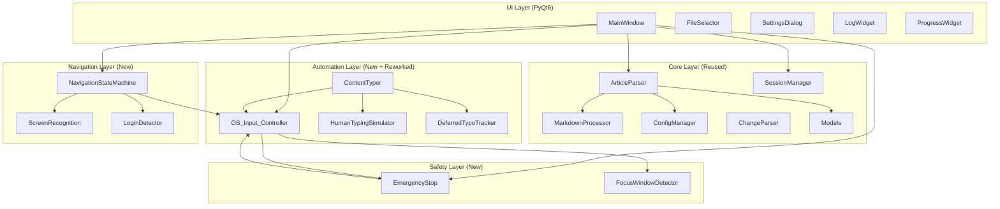
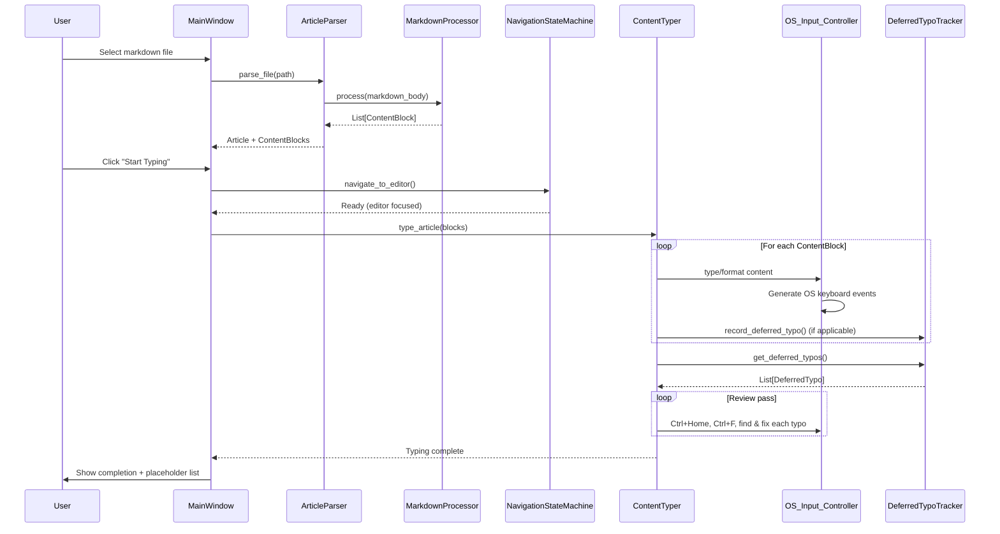
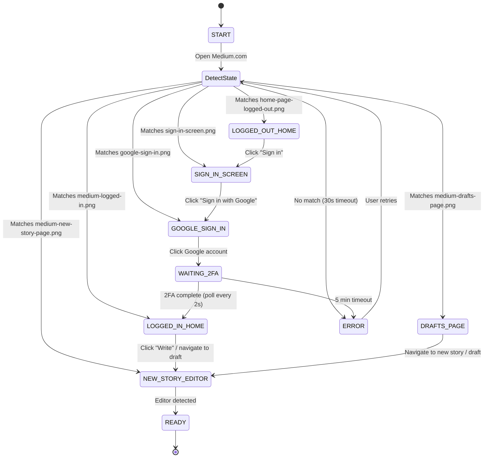

# Medium Keyboard Publisher — Design Document

## Overview

The Medium Keyboard Publisher is a desktop application that publishes markdown articles to Medium by generating real OS-level keyboard and mouse events via pyautogui/pynput. Rather than browser automation (Playwright/Selenium), it types content through the operating system's input layer, producing events indistinguishable from human input.

The system reuses the existing `medium_publisher/` codebase for article parsing, markdown processing, configuration, logging, and human typing simulation. New components handle OS-level input control, screen image recognition for navigation, login detection via a state machine, emergency stop safety controls, and a deferred typo tracker for end-of-document review passes.

### Key Design Decisions

1. **OS-level input over browser automation** — pyautogui generates real keyboard/mouse events at the OS level. Medium cannot distinguish these from human input since no browser APIs are instrumented.
2. **Screen recognition over CSS selectors** — pyautogui's `locateOnScreen()` with reference images replaces CSS selectors for UI element detection. This is resolution/scaling-dependent but avoids any browser instrumentation.
3. **State machine for login flow** — A finite state machine drives navigation through Medium's login flow using screen recognition to detect the current page state and determine the next action.
4. **Deferred typo correction** — 30% of typos are left uncorrected during typing and fixed in a review pass at the end, simulating a human proofreading workflow.
5. **Emergency stop as first-class concern** — All OS-level input must be interruptible within 100ms via hotkey, mouse-to-corner, or UI button.

## Architecture



### Layer Responsibilities

| Layer | Responsibility | Key Modules |
|---|---|---|
| UI | User interaction, file selection, status display, settings | MainWindow, FileSelector, SettingsDialog, LogWidget, ProgressWidget |
| Core | Article parsing, markdown→ContentBlock conversion, config, session state | ArticleParser, MarkdownProcessor, ConfigManager, SessionManager, ChangeParser, Models |
| Automation | OS keyboard/mouse input, typing simulation, formatting, deferred typo tracking | OS_Input_Controller, ContentTyper, HumanTypingSimulator, DeferredTypoTracker |
| Navigation | Screen recognition, login detection, page state machine | ScreenRecognition, LoginDetector, NavigationStateMachine |
| Safety | Emergency stop, focus window detection, key release guarantees | EmergencyStop, FocusWindowDetector |

### Data Flow



## Components and Interfaces

### Reused Components (No Changes)

These modules are reused as-is from the existing codebase:

| Module | Path | Purpose |
|---|---|---|
| `Article`, `ContentBlock`, `Format` | `core/models.py` | Data models with validation |
| `ArticleParser` | `core/article_parser.py` | Frontmatter extraction, body parsing, file validation |
| `MarkdownProcessor` | `core/markdown_processor.py` | Markdown → ContentBlock conversion |
| `ConfigManager` | `core/config_manager.py` | YAML config load/save with dot-notation access |
| `ChangeParser` | `core/change_parser.py` | Version update instruction parsing |
| `HumanTypingSimulator` | `automation/human_typing_simulator.py` | QWERTY adjacent key map, typo generation, timing variation |
| `MediumPublisherLogger` | `utils/logger.py` | Singleton logger with rotation, UI handler support |
| Exception hierarchy | `utils/exceptions.py` | PublishingError, ContentError, FileError, AuthenticationError |

### New Component: OS_Input_Controller

Replaces Playwright's `page.keyboard` and `page.mouse` with pyautogui/pynput OS-level events.

```python
class OS_Input_Controller:
    """Generates real OS-level keyboard and mouse events via pyautogui/pynput."""

    def __init__(self, emergency_stop: EmergencyStop):
        """
        Args:
            emergency_stop: Injected EmergencyStop for checking halt state before every action.
        """

    def type_character(self, char: str) -> None:
        """Type a single character. Checks emergency_stop before each keystroke."""

    def type_text(self, text: str, delay_ms: int = 200) -> None:
        """Type a string character-by-character with configurable delay."""

    def press_key(self, key: str) -> None:
        """Press and release a single key (e.g., 'enter', 'backspace')."""

    def hotkey(self, *keys: str) -> None:
        """Press a key combination (e.g., hotkey('ctrl', 'alt', '1') for Header)."""

    def select_text_backwards(self, char_count: int) -> None:
        """Select text backwards using Shift+Left arrow repeated char_count times."""

    def click_at(self, x: int, y: int) -> None:
        """Move mouse to (x, y) and click. Checks emergency_stop before action."""

    def click_image(self, image_path: str, confidence: float = 0.8) -> bool:
        """Locate image on screen and click its center. Returns False if not found."""

    def release_all_keys(self) -> None:
        """Release all held modifier keys (Ctrl, Shift, Alt). Called on emergency stop."""

    def scroll(self, clicks: int) -> None:
        """Scroll the mouse wheel. Positive = up, negative = down."""
```

**Key design choice**: Every method that generates input checks `emergency_stop.is_stopped()` before executing. If stopped, it raises `EmergencyStopError` immediately.

### New Component: ContentTyper (Reworked)

The existing `ContentTyper` is reworked to use `OS_Input_Controller` instead of Playwright's `page.keyboard`. The rate limiter is removed (OS-level input doesn't need it). Deferred typo tracking is added.

```python
class ContentTyper:
    """Types article content into the focused window using OS-level input."""

    def __init__(
        self,
        input_controller: OS_Input_Controller,
        typing_simulator: HumanTypingSimulator,
        typo_tracker: DeferredTypoTracker,
        config: ConfigManager,
    ):
        """All dependencies injected."""

    def type_article(self, blocks: List[ContentBlock], subtitle: str = "") -> None:
        """Type a complete article: title, subtitle, then content blocks."""

    def type_title(self, title: str) -> None:
        """Type the article title and press Enter."""

    def type_subtitle(self, subtitle: str) -> None:
        """Type subtitle, apply Subheader format (Ctrl+Alt+2), press Enter."""

    def type_paragraph(self, block: ContentBlock) -> None:
        """Type paragraph text with inline formatting, then Enter."""

    def type_header(self, block: ContentBlock) -> None:
        """Type header text and apply Ctrl+Alt+1 (Header) or Ctrl+Alt+2 (Subheader)."""

    def type_code_block(self, block: ContentBlock) -> None:
        """Type ``` to enter code mode, type code without typos, exit."""

    def type_list(self, block: ContentBlock) -> None:
        """Type list items with '* ' or '1. ' prefix per item."""

    def type_link(self, text: str, url: str) -> None:
        """Type link text, select it, Ctrl+K, type URL, Enter."""

    def type_inline_formatting(self, text: str, formatting: List[Format]) -> None:
        """Type text and apply bold/italic/code formatting to marked ranges."""

    def type_placeholder(self, block: ContentBlock) -> None:
        """Type '[image: alt]' or '[table: caption]' without formatting or typos."""

    def type_block_quote(self, block: ContentBlock) -> None:
        """Apply Ctrl+Alt+5 then type quote text."""

    def type_separator(self) -> None:
        """Insert separator via Ctrl+Enter."""

    def perform_review_pass(self) -> None:
        """Navigate to top (Ctrl+Home), find and fix each deferred typo using Ctrl+F."""

    def _type_with_typos(self, text: str, allow_typos: bool = True) -> None:
        """Type text with human-like typos. Immediate typos corrected inline, deferred ones recorded."""
```

### Medium Formatting Shortcuts Reference

| Markdown | Medium Shortcut | Method |
|---|---|---|
| `## Header` | Ctrl+Alt+1 | `type_header()` |
| `### Subheader` | Ctrl+Alt+2 | `type_header()` |
| `**bold**` | Ctrl+B (after select) | `type_inline_formatting()` |
| `*italic*` | Ctrl+I (after select) | `type_inline_formatting()` |
| `` `code` `` | Type backticks around text | `type_inline_formatting()` |
| `[text](url)` | Ctrl+K (after select text) | `type_link()` |
| `* item` | Type `* ` prefix | `type_list()` |
| `1. item` | Type `1. ` prefix | `type_list()` |
| `> quote` | Ctrl+Alt+5 | `type_block_quote()` |
| `---` | Ctrl+Enter | `type_separator()` |
| ` ``` ` | Type triple backticks | `type_code_block()` |

### New Component: DeferredTypoTracker

Tracks typos that are intentionally left uncorrected during typing, to be fixed in a review pass at the end of the document.

```python
@dataclass
class DeferredTypo:
    """A typo left uncorrected during typing, to be fixed in review pass."""
    block_index: int          # Which ContentBlock the typo is in
    char_offset: int          # Character offset within the block's typed text
    wrong_char: str           # The incorrect character that was typed
    correct_char: str         # The character that should have been typed
    surrounding_context: str  # ~20 chars of surrounding text for Ctrl+F search

class DeferredTypoTracker:
    """Records and retrieves deferred typos for the review pass."""

    def __init__(self):
        self._typos: List[DeferredTypo] = []

    def record(self, block_index: int, char_offset: int, wrong_char: str,
               correct_char: str, surrounding_context: str) -> None:
        """Record a deferred typo."""

    def get_all(self) -> List[DeferredTypo]:
        """Return all deferred typos in document order."""

    def clear(self) -> None:
        """Clear all recorded typos (after review pass completes)."""

    @property
    def count(self) -> int:
        """Number of deferred typos pending correction."""
```

### New Component: ScreenRecognition

Wraps pyautogui's `locateOnScreen()` for finding UI elements by reference image matching.

```python
class ScreenRecognition:
    """Finds UI elements on screen by matching reference images."""

    def __init__(self, assets_dir: Path, confidence: float = 0.8):
        """
        Args:
            assets_dir: Path to directory containing reference images.
            confidence: Matching confidence threshold (0.0-1.0).
        """

    def find_on_screen(self, image_name: str) -> Optional[Tuple[int, int]]:
        """Locate image on screen. Returns center (x, y) or None if not found."""

    def is_visible(self, image_name: str) -> bool:
        """Check if a reference image is currently visible on screen."""

    def wait_for(self, image_name: str, timeout_seconds: float = 30,
                 poll_interval: float = 2.0) -> Optional[Tuple[int, int]]:
        """Poll for image to appear on screen. Returns center coords or None on timeout."""

    def capture_reference(self, image_name: str, region: Tuple[int, int, int, int]) -> None:
        """Capture a new reference image from a screen region (for recapture settings)."""

    def set_confidence(self, confidence: float) -> None:
        """Update the matching confidence threshold."""
```

### New Component: LoginDetector / NavigationStateMachine

Implements the login flow as a finite state machine using screen recognition.

```python
class NavigationState(Enum):
    """States in the Medium navigation flow."""
    START = "start"
    LOGGED_OUT_HOME = "logged_out_home"
    SIGN_IN_SCREEN = "sign_in_screen"
    GOOGLE_SIGN_IN = "google_sign_in"
    WAITING_2FA = "waiting_2fa"
    LOGGED_IN_HOME = "logged_in_home"
    DRAFTS_PAGE = "drafts_page"
    NEW_STORY_EDITOR = "new_story_editor"
    ERROR = "error"
    READY = "ready"

class NavigationStateMachine:
    """Drives navigation through Medium's login and editor flow."""

    # Reference image → state mapping
    STATE_IMAGES = {
        "home-page-logged-out.png": NavigationState.LOGGED_OUT_HOME,
        "sign-in-screen.png": NavigationState.SIGN_IN_SCREEN,
        "google-sign-in.png": NavigationState.GOOGLE_SIGN_IN,
        "medium-logged-in.png": NavigationState.LOGGED_IN_HOME,
        "medium-drafts-page.png": NavigationState.DRAFTS_PAGE,
        "medium-new-story-page.png": NavigationState.NEW_STORY_EDITOR,
    }

    def __init__(
        self,
        screen_recognition: ScreenRecognition,
        input_controller: OS_Input_Controller,
        config: ConfigManager,
    ):
        """All dependencies injected."""

    def detect_current_state(self) -> NavigationState:
        """Check all reference images to determine current page state."""

    def navigate_to_editor(self, draft_url: Optional[str] = None) -> bool:
        """
        Execute the full navigation flow from START to READY.
        Opens Medium.com, detects state, and transitions until editor is reached.
        Returns True if editor is ready, False on timeout/error.
        """

    def _transition(self, current: NavigationState) -> NavigationState:
        """Execute the action for the current state and return the next state."""

    def _handle_logged_out_home(self) -> NavigationState:
        """Click 'Sign in' button."""

    def _handle_sign_in_screen(self) -> NavigationState:
        """Click 'Sign in with Google' button."""

    def _handle_google_sign_in(self) -> NavigationState:
        """Click configured Google account email."""

    def _handle_waiting_2fa(self) -> NavigationState:
        """Display message and poll for logged-in state (up to 5 min)."""

    def _handle_logged_in_home(self, draft_url: Optional[str]) -> NavigationState:
        """Click 'Write' button or navigate to draft URL."""

    def _handle_drafts_page(self, draft_url: Optional[str]) -> NavigationState:
        """Navigate to new story or specific draft."""
```

### State Machine Diagram



### New Component: EmergencyStop

Provides immediate halt of all OS-level input automation.

```python
class EmergencyStopError(PublishingError):
    """Raised when emergency stop is triggered."""
    pass

class EmergencyStop:
    """Safety mechanism for immediately halting all automation."""

    def __init__(self, hotkey: str = "ctrl+shift+escape"):
        """
        Args:
            hotkey: Key combination string for emergency stop trigger.
        """

    def start_monitoring(self) -> None:
        """Start listening for hotkey and mouse-to-corner via pynput listener thread."""

    def stop_monitoring(self) -> None:
        """Stop the pynput listener thread."""

    def trigger(self) -> None:
        """Trigger emergency stop. Sets stopped flag and calls release_all_keys."""

    def reset(self) -> None:
        """Reset stopped state (for resume after pause)."""

    def is_stopped(self) -> bool:
        """Check if emergency stop has been triggered."""

    @property
    def is_paused(self) -> bool:
        """Check if automation is in paused state (vs fully stopped)."""

    def pause(self) -> None:
        """Pause automation (stop after current word)."""

    def resume(self) -> None:
        """Resume automation from paused state."""
```

**Implementation details**:
- Uses `pynput.keyboard.GlobalHotKeys` for hotkey detection in a background thread
- pyautogui's built-in `FAILSAFE = True` handles mouse-to-corner detection
- `release_all_keys()` is called on trigger to ensure no modifier keys remain held
- The `is_stopped()` check is performed by `OS_Input_Controller` before every keystroke/click

### New Component: FocusWindowDetector

Detects if the focused window changes during typing, pausing automation if the user switches away from the browser.

```python
class FocusWindowDetector:
    """Monitors the active window to detect focus changes during typing."""

    def __init__(self):
        """Initialize with platform-specific window detection (win32gui on Windows)."""

    def get_active_window_title(self) -> str:
        """Return the title of the currently focused window."""

    def capture_target_window(self) -> None:
        """Capture the current window title as the expected target."""

    def is_target_focused(self) -> bool:
        """Check if the target window still has focus."""
```

### Reworked Component: SessionManager

The existing `SessionManager` is reused with minor extensions for tracking typing progress at the ContentBlock level and deferred typo state.

Additional state fields:
```python
{
    "last_typed_block_index": 0,       # For recovery after errors
    "deferred_typos": [],              # Serialized DeferredTypo list
    "review_pass_completed": False,    # Whether review pass finished
    "batch_articles": [],              # List of file paths for batch mode
    "current_batch_index": 0,          # Current article in batch
}
```

### Reworked Component: UI (PyQt6)

The existing PyQt6 UI components are reused with modifications:

| Component | Changes |
|---|---|
| `MainWindow` | Add Start Typing, Pause/Resume, Emergency Stop buttons. Add countdown display. Add draft URL input field. Add batch file selection. Remove Playwright-specific controls. Add always-on-top toggle. |
| `FileSelector` | Add multi-file selection for batch publishing. Remember last directory. |
| `SettingsDialog` | Add typing speed (base delay), variation range, typo frequency, immediate/deferred ratio, emergency stop hotkey, countdown duration, Google account email, screen recognition confidence. Remove browser/Playwright settings. |
| `LogWidget` | No changes (reused as-is). |
| `ProgressWidget` | Add per-block progress tracking. Add estimated time remaining with typo overhead. Add batch progress (article N of M). |

## Data Models

### Existing Models (Reused)

```python
# core/models.py — no changes
@dataclass
class Format:
    type: str       # bold, italic, code, link
    start: int
    end: int
    url: str = ""

@dataclass
class ContentBlock:
    type: str       # paragraph, header, code, list, table_placeholder, image_placeholder
    content: str
    formatting: List[Format]
    level: int = 0
    metadata: Dict[str, Any] = field(default_factory=dict)

@dataclass
class Article:
    title: str
    subtitle: str = ""
    content: str = ""
    tags: List[str] = field(default_factory=list)
    keywords: List[str] = field(default_factory=list)
    status: str = "draft"
    file_path: str = ""
```

### New Models

```python
@dataclass
class DeferredTypo:
    """A typo left uncorrected during typing, to be fixed in review pass."""
    block_index: int
    char_offset: int
    wrong_char: str
    correct_char: str
    surrounding_context: str  # ~20 chars for Ctrl+F search

@dataclass
class TypingProgress:
    """Tracks typing progress for UI display and recovery."""
    total_blocks: int
    current_block: int
    total_chars: int
    typed_chars: int
    deferred_typo_count: int
    review_pass_started: bool = False
    review_pass_completed: bool = False
    estimated_remaining_seconds: float = 0.0

class NavigationState(Enum):
    """States in the Medium navigation flow."""
    START = "start"
    LOGGED_OUT_HOME = "logged_out_home"
    SIGN_IN_SCREEN = "sign_in_screen"
    GOOGLE_SIGN_IN = "google_sign_in"
    WAITING_2FA = "waiting_2fa"
    LOGGED_IN_HOME = "logged_in_home"
    DRAFTS_PAGE = "drafts_page"
    NEW_STORY_EDITOR = "new_story_editor"
    ERROR = "error"
    READY = "ready"
```

### Configuration Schema

The existing `ConfigManager` loads YAML config. The schema is updated to remove browser/rate-limiter settings and add new fields:

```yaml
# default_config.yaml
typing:
  base_delay_ms: 200          # ~60 WPM
  variation_percent: 30        # ±30% random variation
  human_typing_enabled: true
  typo_frequency: "low"        # low (2%), medium (5%), high (8%)
  immediate_correction_ratio: 0.70  # 70% immediate, 30% deferred
  thinking_pause_min_ms: 500
  thinking_pause_max_ms: 2000
  paragraph_pause_min_ms: 1000
  paragraph_pause_max_ms: 3000

publishing:
  default_mode: "draft"
  max_tags: 5

safety:
  emergency_stop_hotkey: "ctrl+shift+escape"
  countdown_seconds: 3
  focus_check_enabled: true

navigation:
  screen_confidence: 0.8
  poll_interval_seconds: 2
  login_timeout_seconds: 300   # 5 minutes
  page_load_timeout_seconds: 30
  google_account_email: "diverdan326@gmail.com"

ui:
  always_on_top: true
  remember_window_position: true
  remember_last_directory: true

assets:
  reference_images_dir: "assets/medium/"
```

## Correctness Properties

*A property is a characteristic or behavior that should hold true across all valid executions of a system — essentially, a formal statement about what the system should do. Properties serve as the bridge between human-readable specifications and machine-verifiable correctness guarantees.*

### Property 1: Frontmatter round-trip

*For any* valid frontmatter dictionary containing title, subtitle, tags, and keywords, serializing it to a YAML string with `---` delimiters and then parsing it with `ArticleParser.extract_frontmatter()` SHALL produce a dictionary with identical values for all fields.

**Validates: Requirements 1.4, 2.1**

### Property 2: Header parsing preserves level and content

*For any* valid header text string and any header level in {2, 3, 4}, formatting the text as a markdown header (`##`, `###`, or `####` prefix) and parsing it with `MarkdownProcessor._parse_header()` SHALL produce a `ContentBlock` with `type="header"`, the correct `level`, and `content` matching the original text.

**Validates: Requirements 2.2, 2.3, 2.4**

### Property 3: Inline formatting parsing preserves type and position

*For any* text string containing bold (`**text**`), italic (`*text*`), inline code (`` `text` ``), or link (`[text](url)`) markers, parsing with `MarkdownProcessor._parse_formatting()` SHALL produce `Format` objects whose `type` matches the marker kind and whose `start`/`end` indices correctly span the marker positions in the original string.

**Validates: Requirements 2.5, 2.6, 2.8, 2.9**

### Property 4: Code block parsing preserves content

*For any* string of code content and optional language identifier, wrapping the content in triple-backtick delimiters and parsing with `MarkdownProcessor._parse_code_block()` SHALL produce a `ContentBlock` with `type="code"` and `content` exactly matching the original code string.

**Validates: Requirements 2.7**

### Property 5: List parsing preserves items and type

*For any* list of item strings and list type (bullet or numbered), formatting them as a markdown list (`- item` or `1. item`) and parsing with `MarkdownProcessor._parse_list()` SHALL produce a `ContentBlock` with `type="list"`, `metadata["list_type"]` matching the list type, and `content` containing all original item strings.

**Validates: Requirements 2.10, 2.11**

### Property 6: Paragraph breaks produce separate ContentBlocks

*For any* two non-empty text strings, joining them with a double newline (`\n\n`) and processing with `MarkdownProcessor.process()` SHALL produce at least two `ContentBlock` objects, one for each paragraph.

**Validates: Requirements 2.12**

### Property 7: Placeholder detection for tables and images

*For any* valid markdown table (header row + separator + data rows) or image (``), processing with `MarkdownProcessor.process()` SHALL produce a `ContentBlock` with `type="table_placeholder"` or `type="image_placeholder"` respectively, and image placeholders SHALL have `metadata["alt_text"]` matching the original alt text.

**Validates: Requirements 2.13, 2.14**

### Property 8: File validation accepts .md and rejects invalid files

*For any* file path string, `ArticleParser.parse_file()` SHALL accept files with `.md` extension and raise `FileError` for files with any other extension. Additionally, *for any* file content missing frontmatter delimiters or containing malformed YAML, parsing SHALL raise `ContentError`.

**Validates: Requirements 1.3, 1.5**

### Property 9: Navigation state detection returns correct state

*For any* combination of reference image visibility (each of the 6 images either visible or not visible on screen), `NavigationStateMachine.detect_current_state()` SHALL check all 6 reference images and return the `NavigationState` corresponding to the first matching image, or `ERROR` if none match.

**Validates: Requirements 3.3, 3.4**

### Property 10: Content formatting applies correct Medium shortcut

*For any* `ContentBlock` with formatting requirements, the `ContentTyper` SHALL apply the correct Medium keyboard shortcut: `Ctrl+Alt+1` for level-2 headers, `Ctrl+Alt+2` for level-3+ headers and subtitles, `Ctrl+B` for bold text, `Ctrl+I` for italic text, `Ctrl+K` for links (followed by URL and Enter), and `Ctrl+Alt+5` for block quotes.

**Validates: Requirements 4.6, 4.7, 4.8, 4.9, 4.12, 4.15**

### Property 11: List typing uses correct prefix per list type

*For any* list `ContentBlock`, the `ContentTyper` SHALL type `* ` (asterisk + space) before each item for bullet lists and `1. ` (number + dot + space) before each item for numbered lists.

**Validates: Requirements 4.13, 4.14**

### Property 12: Protected content typed without typos

*For any* code block content, URL string, or placeholder text (`[image: ...]`, `[table: ...]`), the `ContentTyper` SHALL type the content with `allow_typos=False`, ensuring no typo simulation is applied.

**Validates: Requirements 4.10, 4.18, 5.14**

### Property 13: Typing speed variation stays within ±30% bounds

*For any* base delay value, every value returned by `HumanTypingSimulator.get_typing_delay(base_delay)` SHALL be within the range `[base_delay * 0.7, base_delay * 1.3]` (with a minimum of 1ms).

**Validates: Requirements 5.1**

### Property 14: Typo generation produces adjacent QWERTY key

*For any* character that has entries in `HumanTypingSimulator.ADJACENT_KEYS`, the character returned by `generate_typo(char)` SHALL be one of the adjacent keys defined for that character, preserving the original case.

**Validates: Requirements 5.4**

### Property 15: Typo frequency approximates configured rate

*For any* typo frequency setting (low=2%, medium=5%, high=8%), over a sufficiently large sample (≥1000 calls), the proportion of `should_make_typo()` returning `True` SHALL be within ±2 percentage points of the configured rate.

**Validates: Requirements 5.3**

### Property 16: Immediate correction delay is 1-3 characters

*For any* call to `HumanTypingSimulator.get_correction_delay()`, the returned value SHALL be in the range [1, 3].

**Validates: Requirements 5.6**

### Property 17: Deferred typo recording preserves all fields

*For any* block index, character offset, wrong character, correct character, and surrounding context string, recording a deferred typo via `DeferredTypoTracker.record()` and then retrieving it via `get_all()` SHALL return a `DeferredTypo` with all fields matching the original values.

**Validates: Requirements 5.7**

### Property 18: Estimated typing time accounts for all overhead

*For any* article with known total character count, base delay, variation percentage, typo frequency, and immediate/deferred ratio, the estimated typing time SHALL equal the sum of: base typing time (chars × base_delay), typo overhead (expected_typos × correction_keystrokes × base_delay), and review pass time (deferred_typos × search_and_fix_time).

**Validates: Requirements 5.15**

### Property 19: Emergency stop releases all held modifier keys

*For any* set of currently held modifier keys (Ctrl, Shift, Alt, in any combination), triggering `EmergencyStop.trigger()` SHALL result in `OS_Input_Controller.release_all_keys()` being called, releasing all held modifiers.

**Validates: Requirements 6.4**

### Property 20: Focus window change pauses typing

*For any* window title that differs from the captured target window title, `FocusWindowDetector.is_target_focused()` SHALL return `False`, causing the `ContentTyper` to pause typing.

**Validates: Requirements 6.9**

### Property 21: Draft URL validation

*For any* URL string matching Medium's draft/story URL pattern (e.g., `https://medium.com/p/<id>/edit` or `https://<publication>.medium.com/<slug>-<id>`), validation SHALL accept it. *For any* URL string not matching these patterns, validation SHALL reject it.

**Validates: Requirements 7.2**

### Property 22: Placeholder listing includes all placeholders

*For any* list of `ContentBlock` objects containing N placeholders (table_placeholder or image_placeholder), the completion notification SHALL list exactly N placeholder entries.

**Validates: Requirements 8.2**

### Property 23: Tag validation enforces max 5 and valid characters

*For any* list of tag strings from frontmatter, the system SHALL use at most the first 5 tags, and each tag SHALL contain only alphanumeric characters, hyphens, and spaces. Tags not matching this pattern SHALL be rejected.

**Validates: Requirements 9.1, 9.3, 9.4, 9.5**

### Property 24: Config save/load round-trip

*For any* valid configuration dictionary with typing, publishing, safety, navigation, and UI settings, saving via `ConfigManager.save_config()` and loading via `ConfigManager.load_config()` SHALL produce a dictionary with identical values for all fields.

**Validates: Requirements 12.11, 12.12**

## Error Handling

### Exception Hierarchy

The existing exception hierarchy from `utils/exceptions.py` is extended with new exceptions for OS-level input and navigation:

```python
PublishingError (base)
├── AuthenticationError      # Login/2FA failures (reused)
├── ContentError             # Markdown parsing, validation (reused)
├── FileError                # File I/O, session persistence (reused)
├── EmergencyStopError       # NEW: Emergency stop triggered
├── NavigationError          # NEW: Screen recognition / state machine failures
├── InputControlError        # NEW: pyautogui/pynput failures
└── FocusLostError           # NEW: Target window lost focus
```

### Error Handling Strategy by Layer

| Layer | Error Type | Handling |
|---|---|---|
| Core (parsing) | `ContentError`, `FileError` | Display error in UI, allow reselection. Log warning for unsupported syntax, skip element. |
| Navigation | `NavigationError` | Display error with screenshot of current state. Allow retry. Log state transition history. |
| Navigation | `AuthenticationError` | Display "Complete 2FA in browser" message. Poll with timeout. |
| Automation | `EmergencyStopError` | Immediately release all keys. Stop all pending input. Display status in UI. Allow resume. |
| Automation | `InputControlError` | Retry up to 3 times. If still failing, trigger emergency stop and display error. |
| Automation | `FocusLostError` | Pause typing. Display "Refocus browser" notification. Resume when target window regains focus. |
| Safety | Any unhandled exception | Trigger emergency stop. Release all keys. Log full traceback. Display error in UI. Save typing progress for recovery. |

### Recovery Mechanisms

1. **Typing progress persistence**: `SessionManager` saves `last_typed_block_index` after each ContentBlock is typed. On error recovery, typing can resume from the last completed block.
2. **Deferred typo state**: Deferred typos are serialized to session state. If the app crashes during the review pass, the remaining typos can be loaded on restart.
3. **Key release guarantee**: `OS_Input_Controller.release_all_keys()` is called in a `finally` block wrapping all typing operations, and also registered via `atexit` to handle abnormal exits.
4. **Graceful degradation**: Unsupported markdown syntax is logged as a warning and skipped rather than causing a fatal error.

## Testing Strategy

### Testing Approach

The testing strategy uses a dual approach:

1. **Property-based tests** (via `hypothesis` library): Verify universal properties across randomly generated inputs. Each property test runs a minimum of 100 iterations and references its design document property.
2. **Unit tests** (via `pytest`): Verify specific examples, edge cases, integration points, and error conditions.

### Property-Based Testing Configuration

- **Library**: `hypothesis` (Python)
- **Minimum iterations**: 100 per property (`@settings(max_examples=100)`)
- **Tag format**: `# Feature: medium-keyboard-publisher, Property N: <property_text>`

### Test Organization

```
tests/
├── unit/
│   ├── test_article_parser.py       # Parsing edge cases, error handling
│   ├── test_markdown_processor.py   # Block type detection, formatting
│   ├── test_content_typer.py        # Formatting sequences, placeholder handling
│   ├── test_os_input_controller.py  # Key generation, emergency stop integration
│   ├── test_navigation_state.py     # State transitions, timeout handling
│   ├── test_screen_recognition.py   # Image matching, confidence thresholds
│   ├── test_emergency_stop.py       # Trigger, release, pause/resume
│   ├── test_deferred_typo.py        # Record, retrieve, clear
│   ├── test_session_manager.py      # State persistence, recovery
│   ├── test_config_manager.py       # Config load/save, validation
│   └── test_focus_detector.py       # Window title detection
├── property/
│   ├── test_prop_frontmatter.py     # Property 1: Frontmatter round-trip
│   ├── test_prop_parsing.py         # Properties 2-7: Markdown parsing
│   ├── test_prop_validation.py      # Property 8: File validation
│   ├── test_prop_navigation.py      # Property 9: State detection
│   ├── test_prop_formatting.py      # Properties 10-12: Formatting & typing
│   ├── test_prop_typing_sim.py      # Properties 13-18: Typing simulation
│   ├── test_prop_safety.py          # Properties 19-20: Emergency stop, focus
│   ├── test_prop_url_validation.py  # Property 21: Draft URL validation
│   ├── test_prop_placeholders.py    # Property 22: Placeholder listing
│   ├── test_prop_tags.py            # Property 23: Tag validation
│   └── test_prop_config.py          # Property 24: Config round-trip
└── integration/
    ├── test_navigation_flow.py      # Full login flow with mocked screen recognition
    ├── test_typing_flow.py          # Full article typing with mocked OS input
    └── test_batch_publishing.py     # Multi-article sequential processing
```

### Mocking Strategy

Since the application generates real OS-level input events, all automation tests mock the OS-level libraries:

| Component | Mock Target | Purpose |
|---|---|---|
| `OS_Input_Controller` | `pyautogui.press`, `pyautogui.typewrite`, `pyautogui.click`, `pyautogui.moveTo` | Verify correct key sequences without generating real input |
| `ScreenRecognition` | `pyautogui.locateOnScreen`, `pyautogui.locateCenterOnScreen` | Simulate reference image matches/misses |
| `EmergencyStop` | `pynput.keyboard.GlobalHotKeys` | Simulate hotkey triggers |
| `FocusWindowDetector` | `win32gui.GetForegroundWindow`, `win32gui.GetWindowText` | Simulate window focus changes |

### Key Test Scenarios (Unit)

- **Parsing**: Empty files, missing frontmatter, malformed YAML, nested formatting, deeply nested headers
- **Typing**: Empty content blocks, very long paragraphs, special characters, unicode, mixed formatting
- **Navigation**: All 6 state transitions, timeout scenarios, 2FA wait, retry after error
- **Safety**: Emergency stop during typing, during formatting, during review pass. Focus loss mid-word. Key release on crash.
- **Session**: Save/restore mid-article, batch progress tracking, deferred typo serialization
