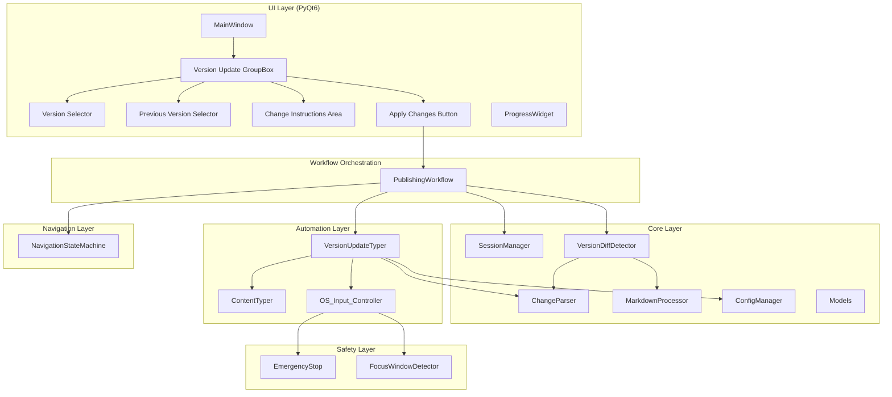
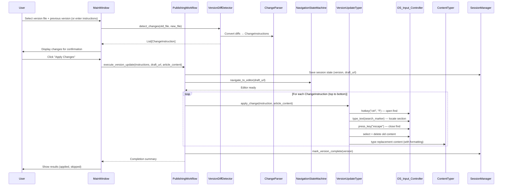
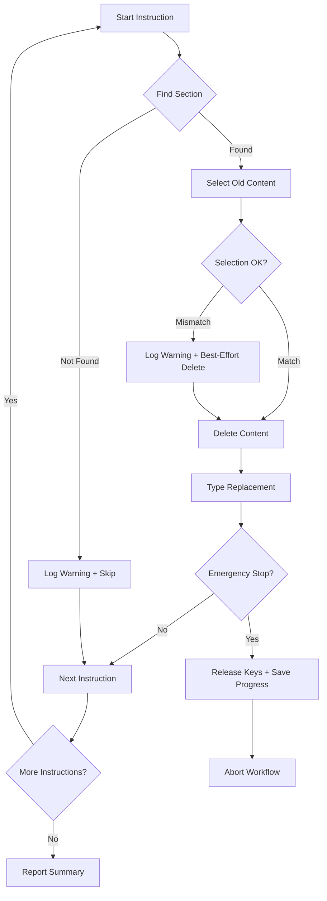

# Version Update Workflow — Design Document

## Overview

The Version Update Workflow extends the Medium Keyboard Publisher with the ability to update an existing Medium draft by detecting changes between article versions and applying them through OS-level keyboard automation. Rather than retyping an entire article, the system navigates to changed sections using Ctrl+F, selects and deletes old content, and types replacement content with the same human-like behavior as the initial publishing workflow.

Two change detection modes are supported: automatic diff-based comparison via `MarkdownProcessor.compare_versions()` and manual natural language instructions via `ChangeParser.parse_instructions()`. Both produce a unified list of `ChangeInstruction` objects that the new `VersionUpdateTyper` processes sequentially in document order.

### Key Design Decisions

1. **Reuse over rebuild** — `ChangeParser`, `MarkdownProcessor.compare_versions()`, `ContentTyper`, `SessionManager`, and `NavigationStateMachine` are reused as-is. New components wrap and orchestrate them.
2. **Ctrl+F for navigation** — The browser's native find dialog locates sections by search marker text. This avoids fragile cursor-position tracking across a long document.
3. **Document-order processing** — Changes are applied top-to-bottom to prevent cursor drift from earlier modifications invalidating later search positions.
4. **Graceful skip on failure** — If a section cannot be found, the instruction is skipped and logged rather than aborting the entire update.
5. **Safety controls inherited** — All OS input flows through `OS_Input_Controller`, which checks `EmergencyStop` and `FocusWindowDetector` before every action.

## Architecture



### Data Flow




## Components and Interfaces

### Reused Components (No Changes)

| Module | Path | Purpose |
|---|---|---|
| `ChangeParser` | `core/change_parser.py` | Parses natural language instructions into `ChangeInstruction` objects; extracts search markers |
| `MarkdownProcessor` | `core/markdown_processor.py` | `compare_versions()` diffs two markdown files by section; `process()` converts markdown to `ContentBlock` list |
| `ContentTyper` | `automation/content_typer.py` | Types content with human-like behavior, formatting shortcuts, typo simulation |
| `OS_Input_Controller` | `automation/os_input_controller.py` | OS-level keyboard/mouse via pyautogui with safety checks before every action |
| `SessionManager` | `core/session_manager.py` | Persists session state (version, draft URL, completed versions) to disk |
| `NavigationStateMachine` | `navigation/navigation_state_machine.py` | Navigates to Medium editor via screen recognition state machine |
| `ConfigManager` | `core/config_manager.py` | YAML config with dot-notation access |
| `EmergencyStop` | `safety/emergency_stop.py` | Hotkey/mouse-corner halt with key release |
| `FocusWindowDetector` | `safety/focus_window_detector.py` | Detects window focus loss during automation |
| `Article`, `ContentBlock`, `Format` | `core/models.py` | Existing data models |
| `ChangeInstruction`, `ChangeAction` | `core/change_parser.py` | Existing change instruction dataclass and action enum |

### New Component: VersionDiffDetector

Wraps `MarkdownProcessor.compare_versions()` and converts its raw diff tuples into `ChangeInstruction` objects compatible with `VersionUpdateTyper`.

```python
class VersionDiffDetector:
    """Detects changes between two article versions and produces ChangeInstructions.

    Wraps MarkdownProcessor.compare_versions() to convert diff results
    into the same ChangeInstruction format used by ChangeParser, enabling
    a unified processing pipeline in VersionUpdateTyper.
    """

    def __init__(self, markdown_processor: MarkdownProcessor):
        """
        Args:
            markdown_processor: Injected MarkdownProcessor for diff comparison.
        """

    def detect_changes(
        self, old_file: str, new_file: str
    ) -> List[ChangeInstruction]:
        """Compare two version files and return structured change instructions.

        Reads both files, calls compare_versions(), and maps each diff tuple
        to a ChangeInstruction:
          - 'added'    → ChangeAction.ADD with new_content
          - 'modified' → ChangeAction.REPLACE with section and new_content
          - 'deleted'  → ChangeAction.DELETE with section

        Args:
            old_file: Path to the previous version markdown file.
            new_file: Path to the current version markdown file.

        Returns:
            List of ChangeInstruction objects sorted by document order.

        Raises:
            FileError: If either file cannot be read.
        """

    def _diff_to_instruction(
        self, change_type: str, section_id: str, new_content: str
    ) -> ChangeInstruction:
        """Convert a single diff tuple to a ChangeInstruction."""

    def _sort_by_document_order(
        self, instructions: List[ChangeInstruction], article_content: str
    ) -> List[ChangeInstruction]:
        """Sort instructions by their section's position in the document (top to bottom)."""
```

### New Component: VersionUpdateTyper

Orchestrates the find → select → delete → type cycle for each change instruction. Uses `OS_Input_Controller` for all keyboard actions and delegates content typing to `ContentTyper`.

```python
class VersionUpdateTyper:
    """Applies change instructions to a Medium draft via OS-level keyboard automation.

    For each ChangeInstruction:
    1. Opens Ctrl+F and types the search marker to locate the section
    2. Closes find dialog and positions cursor
    3. Selects old content using Shift+Arrow keys
    4. Deletes selected content
    5. Types replacement content via ContentTyper (with formatting, typos)

    All keyboard actions go through OS_Input_Controller, which checks
    EmergencyStop and FocusWindowDetector before every action.
    """

    def __init__(
        self,
        input_controller: OS_Input_Controller,
        content_typer: ContentTyper,
        change_parser: ChangeParser,
        config: ConfigManager,
    ):
        """
        Args:
            input_controller: OS-level keyboard/mouse controller.
            content_typer: Types content with human-like behavior.
            change_parser: Extracts search markers from instructions.
            config: Application configuration.
        """

    def apply_changes(
        self,
        instructions: List[ChangeInstruction],
        article_content: str,
        status_cb: Optional[Callable[[str], None]] = None,
    ) -> UpdateResult:
        """Apply all change instructions to the currently focused Medium editor.

        Processes instructions in document order (top to bottom).
        Skips instructions whose search marker is not found.

        Args:
            instructions: Change instructions sorted by document order.
            article_content: Full article markdown for search marker extraction.
            status_cb: Optional callback for status messages.

        Returns:
            UpdateResult with counts of applied, skipped, and failed instructions.
        """

    def _apply_single_change(
        self,
        instruction: ChangeInstruction,
        article_content: str,
    ) -> bool:
        """Apply a single change instruction. Returns True on success."""

    def _find_section(self, search_marker: str) -> bool:
        """Open Ctrl+F, type search marker, close dialog. Returns True if found."""

    def _select_and_delete(self, char_count: int) -> None:
        """Select char_count characters using Shift+Down/Right and delete them."""

    def _type_replacement(
        self,
        new_content: str,
        formatting: List[Format],
    ) -> None:
        """Type replacement content via ContentTyper with formatting applied."""

    def _handle_add(
        self, instruction: ChangeInstruction, article_content: str
    ) -> bool:
        """Handle ADD/INSERT_AFTER/INSERT_BEFORE: navigate to position, type new content."""

    def _handle_replace(
        self, instruction: ChangeInstruction, article_content: str
    ) -> bool:
        """Handle REPLACE/UPDATE: find section, select old content, delete, type new."""

    def _handle_delete(
        self, instruction: ChangeInstruction, article_content: str
    ) -> bool:
        """Handle DELETE: find section, select content including header, delete."""
```


### Extended Component: PublishingWorkflow

The existing `PublishingWorkflow` gains a new method `execute_version_update()` that orchestrates the version update flow. This reuses the existing navigation, countdown, and safety infrastructure.

```python
# Added to PublishingWorkflow class

def execute_version_update(
    self,
    instructions: List[ChangeInstruction],
    article_content: str,
    draft_url: str,
    version: str,
    status_cb: Optional[Callable[[str], None]] = None,
    progress_cb: Optional[Callable[[int, int], None]] = None,
) -> UpdateResult:
    """Execute the version update workflow end-to-end.

    1. Save session state (version, draft URL)
    2. Navigate to draft URL via NavigationStateMachine
    3. Delegate to VersionUpdateTyper.apply_changes()
    4. Mark version complete in SessionManager
    5. Return summary of applied/skipped changes

    Args:
        instructions: Parsed change instructions.
        article_content: Full markdown content of the new version.
        draft_url: Medium draft URL to navigate to.
        version: Version identifier (e.g., "v2").
        status_cb: Status message callback.
        progress_cb: Progress callback (current_instruction, total).

    Returns:
        UpdateResult with applied/skipped/failed counts.
    """
```

### Extended Component: MainWindow (UI Additions)

The existing `MainWindow` gains a "Version Update" group box with controls for the version update workflow.

```python
# New UI elements added to MainWindow._init_ui()

def _build_version_update_group(self) -> QGroupBox:
    """Build the Version Update group box.

    Contains:
    - Version Selector: QComboBox with v1–v5 options
    - Previous Version Selector: file picker (QLineEdit + Browse button)
    - Change Instructions Area: QTextEdit for natural language instructions
    - Apply Changes button
    - Draft URL display (from session state)
    - Detected changes summary label
    """

def _on_version_changed(self, version: str) -> None:
    """Show/hide version update controls based on selection.

    v1: Hide version update controls, show standard typing workflow.
    v2+: Show version update controls (previous version picker,
         change instructions area, Apply Changes button).
    """

def _on_browse_previous_version(self) -> None:
    """Open file dialog for selecting previous version file."""

def _on_apply_changes(self) -> None:
    """Validate inputs, detect/parse changes, show confirmation, start workflow."""

def _auto_discover_versions(self, selected_file: Path) -> List[Path]:
    """Discover version files in the parent versions/ directory.

    Scans for files matching v{N}-{article-name}.md pattern,
    sorts by version number ascending.

    Args:
        selected_file: The currently selected version file.

    Returns:
        Sorted list of discovered version file paths.
    """

def _suggest_previous_version(self, selected_file: Path) -> Optional[Path]:
    """Suggest v{N-1} as the previous version based on selected file name.

    Parses the version number from the filename, decrements it,
    and checks if that file exists in the same directory.

    Args:
        selected_file: The currently selected version file.

    Returns:
        Path to suggested previous version, or None if not found.
    """
```

### Version Update Worker Thread

```python
class VersionUpdateWorker(QThread):
    """Runs the version update workflow in a background thread.

    Signals:
        status_update(str): Status messages.
        instruction_progress(int, int): (current_instruction, total).
        finished_signal(bool, str): (success, summary_message).
    """

    status_update = pyqtSignal(str)
    instruction_progress = pyqtSignal(int, int)
    finished_signal = pyqtSignal(bool, str)

    def __init__(
        self,
        workflow: PublishingWorkflow,
        instructions: List[ChangeInstruction],
        article_content: str,
        draft_url: str,
        version: str,
    ) -> None:
        super().__init__()
        # ...

    def run(self) -> None:
        """Execute version update workflow (called by QThread.start)."""
```

## Data Models

### Existing Models (Reused As-Is)

```python
# core/change_parser.py — reused
class ChangeAction(Enum):
    REPLACE = "replace"
    ADD = "add"
    UPDATE = "update"
    DELETE = "delete"
    INSERT_AFTER = "insert_after"
    INSERT_BEFORE = "insert_before"

@dataclass
class ChangeInstruction:
    action: ChangeAction
    section: Optional[str] = None
    search_text: Optional[str] = None
    new_content: Optional[str] = None
    position: Optional[str] = None
    raw_instruction: str = ""
```

### New Models

```python
@dataclass
class UpdateResult:
    """Result of a version update workflow execution.

    Attributes:
        success: True if at least one instruction was applied.
        total_instructions: Total number of instructions processed.
        applied_count: Number of instructions successfully applied.
        skipped_count: Number of instructions skipped (section not found).
        failed_count: Number of instructions that failed during execution.
        applied_sections: List of section names that were updated.
        skipped_sections: List of section names that were skipped with reasons.
        failed_sections: List of section names that failed with error details.
    """
    success: bool
    total_instructions: int
    applied_count: int = 0
    skipped_count: int = 0
    failed_count: int = 0
    applied_sections: List[str] = field(default_factory=list)
    skipped_sections: List[Tuple[str, str]] = field(default_factory=list)  # (section, reason)
    failed_sections: List[Tuple[str, str]] = field(default_factory=list)   # (section, error)


@dataclass
class VersionFileInfo:
    """Metadata about a discovered version file.

    Attributes:
        path: Full path to the version file.
        version_number: Extracted version number (1, 2, 3, ...).
        article_name: Article name portion of the filename.
        filename: Just the filename (e.g., "v2-my-article.md").
    """
    path: Path
    version_number: int
    article_name: str
    filename: str
```

### Extended Session State

The existing `SessionManager` state dictionary gains these fields (no code changes needed — `save_state()` accepts arbitrary keys):

```python
{
    # Existing fields...
    "current_version": "v2",                    # Current version being applied
    "draft_url": "https://medium.com/p/.../edit",  # Persisted across updates
    "versions_completed": ["v1", "v2"],         # Completed version list
    # New fields for version update tracking:
    "version_update_in_progress": False,        # Whether an update is running
    "last_applied_instruction_index": 0,        # For recovery after crash
    "version_update_instructions_total": 0,     # Total instructions in current update
}
```


## Correctness Properties

*A property is a characteristic or behavior that should hold true across all valid executions of a system — essentially, a formal statement about what the system should do. Properties serve as the bridge between human-readable specifications and machine-verifiable correctness guarantees.*

### Property 1: Version filename validation

*For any* string, the version filename validator SHALL accept it if and only if it matches the pattern `v{N}-{article-name}.md` where N is a positive integer and article-name is a non-empty kebab-case string. All other strings SHALL be rejected.

**Validates: Requirements 1.2**

### Property 2: Diff detection and conversion correctness

*For any* two markdown documents composed of named sections, `MarkdownProcessor.compare_versions()` SHALL classify every section difference correctly: sections present only in the new document as "added", sections present in both but with different content as "modified", and sections present only in the old document as "deleted". Furthermore, `VersionDiffDetector._diff_to_instruction()` SHALL map "added" to `ChangeAction.ADD`, "modified" to `ChangeAction.REPLACE`, and "deleted" to `ChangeAction.DELETE`.

**Validates: Requirements 2.2, 2.3, 2.4, 2.5, 2.6**

### Property 3: Change instruction parsing produces correct actions

*For any* natural language instruction string containing a recognized action keyword (replace, add, update, delete, insert after, insert before), `ChangeParser.parse_instructions()` SHALL produce a `ChangeInstruction` with the corresponding `ChangeAction` and a non-empty section identifier extracted from the instruction.

**Validates: Requirements 3.2**

### Property 4: Document-order processing invariant

*For any* list of `ChangeInstruction` objects targeting distinct sections in a markdown document, `VersionUpdateTyper.apply_changes()` SHALL process them in ascending order of their section's position (line number) in the document, regardless of the order they appear in the input list.

**Validates: Requirements 4.5**

### Property 5: Formatting dispatch correctness

*For any* `ContentBlock` with a recognized type (paragraph, header, code, list, table_placeholder, image_placeholder), the `VersionUpdateTyper._type_replacement()` method SHALL delegate to the corresponding `ContentTyper` method: `type_paragraph()` for paragraphs, `type_header()` for headers, `type_code_block()` for code, `type_list()` for lists, and `type_placeholder()` for placeholders.

**Validates: Requirements 6.3**

### Property 6: Session state persistence round-trip

*For any* session state containing a version string, a draft URL string, and a list of completed version strings, calling `SessionManager.save_state()` followed by `SessionManager.restore_state()` SHALL return a state dictionary with identical values for `current_version`, `draft_url`, and `versions_completed`.

**Validates: Requirements 8.2, 8.3, 8.4**

### Property 7: Apply Changes button enable logic

*For any* boolean combination of (has_change_instructions, has_previous_version_file), the "Apply Changes" button SHALL be enabled if and only if at least one of these is True. When both are False, the button SHALL be disabled.

**Validates: Requirements 9.5**

### Property 8: Version file discovery and sorting

*For any* directory containing a mix of files, `_auto_discover_versions()` SHALL return only files matching the pattern `v{N}-{article-name}.md`, and the returned list SHALL be sorted by version number in ascending order (v1 before v2 before v3, etc.).

**Validates: Requirements 11.1, 11.2**

### Property 9: Previous version suggestion

*For any* selected version file with version number N where N > 1, `_suggest_previous_version()` SHALL return the path to `v{N-1}-{article-name}.md` in the same directory if that file exists, or None if it does not exist.

**Validates: Requirements 11.3, 11.4**


## Error Handling

### Error Categories

| Error Type | Source | Handling |
|---|---|---|
| `FileError` | Version file not found or unreadable | Display error in UI, abort workflow |
| `ContentError` | Malformed markdown, empty content | Display error, abort workflow |
| Section not found | Ctrl+F search fails to locate marker | Log warning, skip instruction, continue |
| Selection mismatch | Character count doesn't match expected | Log warning, proceed with best-effort |
| `EmergencyStopError` | User triggers emergency stop | Halt immediately, release keys, save progress |
| `FocusLostError` | Target window loses focus | Pause workflow, notify user to refocus |
| `InputControlError` | pyautogui fails to execute action | Log error, skip instruction, continue |
| Diff comparison failure | compare_versions() encounters error | Display error, fall back to manual instructions |

### Error Flow



### Recovery Strategy

1. **Crash during update**: `SessionManager` persists `last_applied_instruction_index` after each successful instruction. On restart, the user can see which instructions were applied and resume manually.
2. **Emergency stop**: All modifier keys are released via `OS_Input_Controller.release_all_keys()`. Progress is saved. The user can review the draft and decide whether to retry remaining instructions.
3. **Focus loss**: The workflow pauses (not aborts). When the user refocuses the browser, they can resume from where it paused.
4. **Skipped instructions**: The completion summary lists all skipped instructions with reasons, allowing the user to apply them manually or adjust instructions and retry.

## Testing Strategy

### Dual Testing Approach

This feature uses both unit tests and property-based tests for comprehensive coverage.

**Property-Based Testing Library**: [Hypothesis](https://hypothesis.readthedocs.io/) (Python)

**Configuration**: Minimum 100 iterations per property test (`@settings(max_examples=100)`)

**Tag Format**: Each property test includes a comment referencing its design property:
```python
# Feature: version-update-workflow, Property 1: Version filename validation
```

### Property Tests

| Property | Test File | What It Tests |
|---|---|---|
| 1: Filename validation | `tests/property/test_version_filename.py` | Valid/invalid filename patterns |
| 2: Diff detection + conversion | `tests/property/test_diff_detection.py` | Section diff classification and ChangeAction mapping |
| 3: Instruction parsing | `tests/property/test_instruction_parsing.py` | Action keyword → ChangeAction mapping |
| 4: Document-order processing | `tests/property/test_document_order.py` | Instructions processed in section position order |
| 5: Formatting dispatch | `tests/property/test_formatting_dispatch.py` | ContentBlock type → ContentTyper method dispatch |
| 6: Session round-trip | `tests/property/test_session_roundtrip.py` | Save/restore preserves version, URL, completed list |
| 7: Button enable logic | `tests/property/test_button_logic.py` | Enable iff instructions or previous file provided |
| 8: File discovery + sorting | `tests/property/test_version_discovery.py` | Discover matching files, sort by version ascending |
| 9: Previous version suggestion | `tests/property/test_version_suggestion.py` | Suggest v{N-1} when it exists |

### Unit Tests (Example-Based)

| Area | Test File | Key Scenarios |
|---|---|---|
| VersionUpdateTyper | `tests/unit/test_version_update_typer.py` | Ctrl+F sequence, select+delete, skip on not-found, emergency stop handling |
| VersionDiffDetector | `tests/unit/test_version_diff_detector.py` | End-to-end diff with real markdown files, empty files, identical files |
| PublishingWorkflow (update) | `tests/unit/test_publishing_workflow_update.py` | Full update orchestration, navigation, error recovery |
| MainWindow (version UI) | `tests/ui/test_version_update_ui.py` | Show/hide controls, version selection, auto-discovery |
| UpdateResult | `tests/unit/test_update_result.py` | Result aggregation, summary formatting |

### Integration Tests

| Area | Test File | What It Tests |
|---|---|---|
| End-to-end update flow | `tests/integration/test_version_update_flow.py` | Full pipeline with mocked OS input: parse → detect → navigate → apply |
| Session persistence | `tests/integration/test_session_persistence.py` | Save state, restart, restore, verify continuity |

### Test Execution

```cmd
REM Run all property tests
python -m pytest medium_publisher/tests/property/ -v --tb=short

REM Run all unit tests for version update
python -m pytest medium_publisher/tests/unit/test_version_update_typer.py -v

REM Run full test suite
python -m pytest medium_publisher/tests/ -v --tb=short
```
