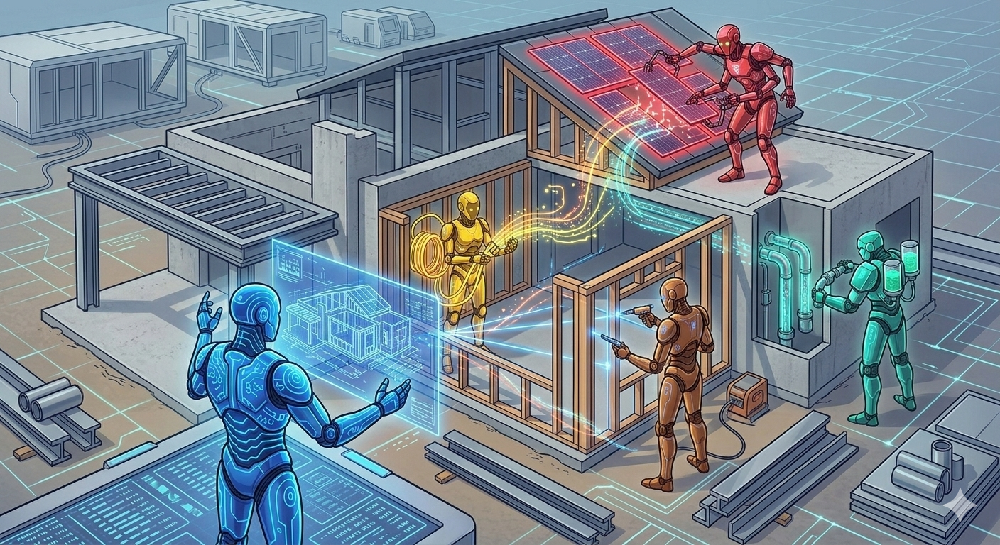

# Teams Post — Multi-Agent Systems

**Channel**: Jabil Developer Network — Architecture Community
**Subject Line**: Your single AI agent is doing too many jobs. Here's what happens when you split the work.
**Featured Image**: `images/featured-image.png`
**Article URL**: https://medium.com/gitconnected/multi-agent-systems-when-ai-agents-collaborate-4e825322dd2e

---

## One Agent Doing Everything Is Like One Engineer Doing Everything

We've all seen it — a single AI agent handling triage, knowledge retrieval, response generation, escalation, and learning. It works in a demo. It falls apart at scale.

A customer service deployment split the work across five specialized agents. The results:

- **65% of interactions** handled without a human
- **12-second response time** (down from 4 minutes)
- **60% reduction** in support costs
- Accuracy jumped from 85% to 92%

The economics are straightforward. If errors cost you $50 each, a multi-agent system saves $3.42 per interaction after the extra API costs. At 100K interactions/month, that's $342K.

## The Catch

Coordination overhead is real. Past 5 agents, you spend more time orchestrating than executing. And multi-agent systems fail in predictable ways — deadlocks, rate limit collisions, cascading timeouts. You need circuit breakers and retry logic before production, not after.

The article covers three coordination patterns, a working LangGraph implementation, break-even analysis, and a 6-week build roadmap.

**Part 3 of the Agentic AI series** — [Read the full article](https://medium.com/gitconnected/multi-agent-systems-when-ai-agents-collaborate-4e825322dd2e)
