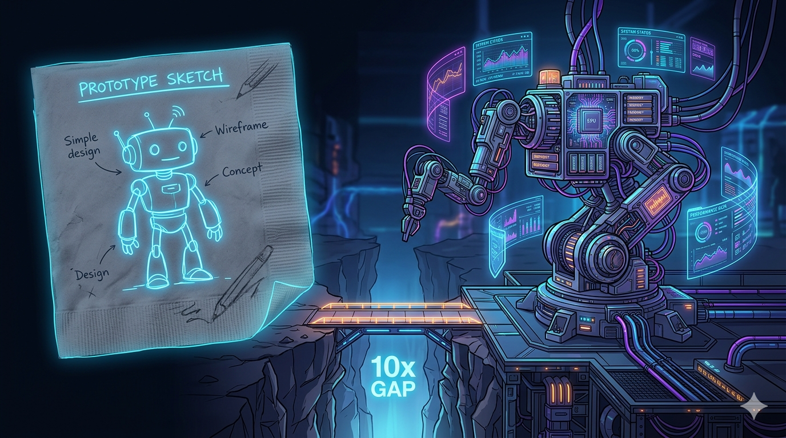

# Teams Post — Building Your First Agentic AI System

**Channel**: Jabil Developer Network — Architecture Community
**Subject Line**: That 50-line AI script from the weekend demo is now 3,000 lines. Most of it has nothing to do with AI.
**Featured Image**: `images/featured_image.png`
**Article URL**: https://medium.com/@the-architect-ds/building-your-first-agentic-ai-system-a-practical-guide-eab2a281de62

---

## The Demo-to-Production Gap Is Mostly Engineering, Not AI

Someone builds a prototype on a Saturday. It works. Leadership loves it. "When can we roll this out?" Three months later, the script has memory, guardrails, cost controls, a kill switch, and a human-in-the-loop approval chain.

Most of that work had nothing to do with AI. It was just engineering.

## Three Things That Separate Projects That Ship From Projects That Die

**Cost model first.** Claude Opus at scale runs ~$1,500/month. A hybrid setup — cheap models for routine work, expensive models only for real reasoning — drops that to ~$450. Same quality where it counts. That math is what gets you past the pilot phase.

**Guardrails before accuracy.** Projects with better AI get killed because leadership doesn't trust them. Trust comes from kill switches, cost caps, and confidence scores that route uncertain decisions to humans.

**Most "agent" projects don't need agents.** If you can draw the workflow on a whiteboard before coding, that's a chain, not an agent. About 70% of the agent projects I've reviewed were over-engineered.

The article has the full architecture breakdown, working code, cost modeling, and the mistakes that keep showing up.

**Part 4 of the Agentic AI series** — [Read the full article](https://medium.com/@the-architect-ds/building-your-first-agentic-ai-system-a-practical-guide-eab2a281de62)
