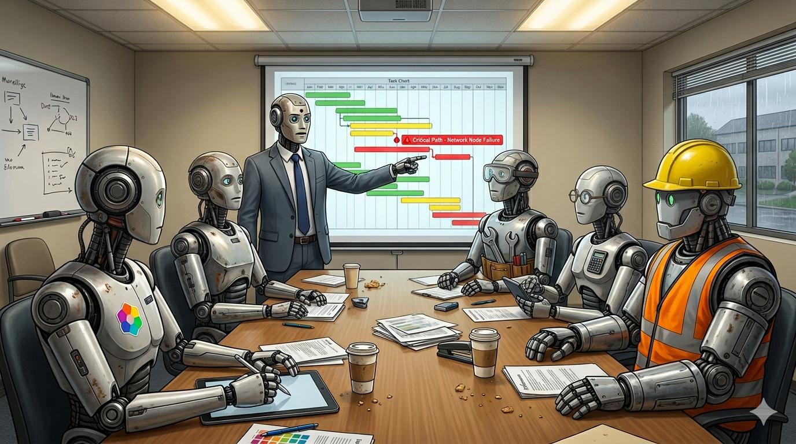

# Teams Post — The Promise/Work Pattern

**Channel**: Jabil Developer Network — Architecture Community
**Subject Line**: Your agent crashed mid-task. The user's request is gone. No retry, no recovery, no record it ever happened.
**Featured Image**: `images/featured_image.png`
**Article URL**: https://medium.com/@the-architect-ds/the-promise-work-pattern-kubernetes-style-orchestration-for-ai-agents-de0945951dae

---

## The Problem With Fire-and-Forget Agents

Most agent systems today are synchronous and stateless. User sends a request, agent processes it, returns a result. If the agent crashes mid-task — and they do — the request is just gone. There's no retry mechanism, no recovery path, and nothing in the logs to show it ever happened.

Kubernetes solved this for containers years ago with declarative reconciliation: describe the desired state, let the system figure out how to get there, and keep retrying until it does. The Promise/Work pattern applies the same idea to AI agent orchestration.

## How It Works

A **Promise** is a declaration of desired outcome — "analyze this document and produce a summary." A **Work** object tracks the actual execution — which agent picked it up, what step it's on, what happened when it failed. An orchestrator watches for drift between promise and reality and reconciles.

The result: agents that survive crashes, retry failed steps, and maintain a complete audit trail. The article includes a working Python implementation with LangGraph and a comparison to traditional orchestration approaches.

**Part 5 of the Agentic AI series** — [Read the full article](https://medium.com/@the-architect-ds/the-promise-work-pattern-kubernetes-style-orchestration-for-ai-agents-de0945951dae)
