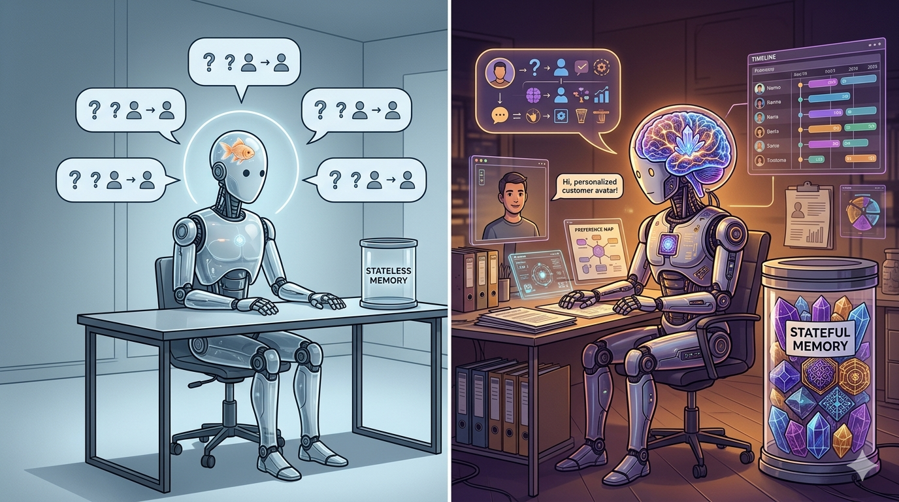

# Teams Post — Memory Systems for AI Agents

**Channel**: Jabil Developer Network — Architecture Community
**Subject Line**: Your agent forgets everything between conversations. It re-discovers the same information, makes the same mistakes, and never learns.
**Featured Image**: `images/featured_image.png`
**Article URL**: https://medium.com/@the-architect-ds/memory-systems-for-ai-agents-beyond-context-windows-967b39ce9896

---

## Why Context Windows Aren't Memory

A 128K context window feels like a lot until your agent needs to remember a decision it made three conversations ago. Context windows are short-term — they hold the current conversation. Memory is long-term — it persists across sessions, consolidates patterns, and lets agents actually learn from experience.

## The Three Memory Layers

The article breaks down a practical memory architecture for production agents:

- **Working memory** — the current conversation context, managed by the LLM's context window
- **Episodic memory** — past interactions stored in a vector database, retrieved by semantic similarity
- **Semantic memory** — consolidated knowledge extracted from episodes, like "this user prefers concise answers" or "this codebase uses pytest, not unittest"

The key insight: memory retrieval is harder than memory storage. Knowing what to remember when is the real engineering challenge. The article covers vector database selection, embedding strategies, memory consolidation patterns, and a working implementation with retrieval-augmented generation.

**Part 6 of the Agentic AI series** — [Read the full article](https://medium.com/@the-architect-ds/memory-systems-for-ai-agents-beyond-context-windows-967b39ce9896)
