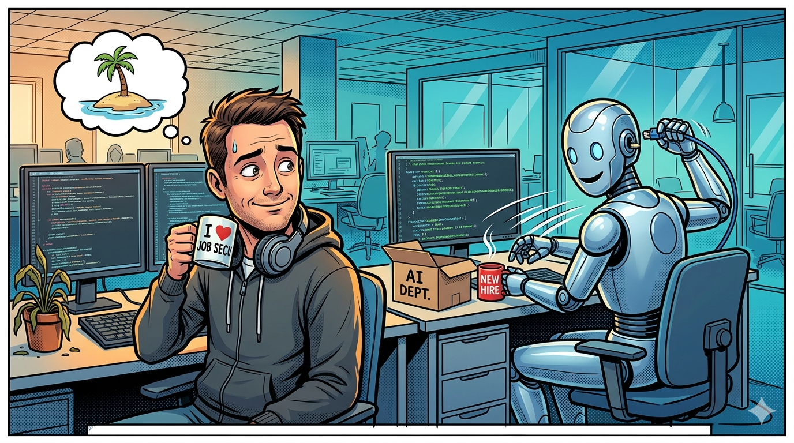

# Teams Post — How to AI-Proof Your Career

**Channel**: Jabil Developer Network — Architecture Community
**Subject Line**: Software dev postings down 35%. Entry-level hiring down 50%+. Bootcamps shutting down. "Learn to code" aged badly.
**Featured Image**: `images/featured_image.png`
**Article URL**: [TO BE ADDED AFTER PUBLICATION]

---

## Nobody Gets Fired by AI on a Tuesday

What happens is quieter. AI absorbs your tasks one by one until your role is hollow. Your title stays the same. Your job doesn't. McKinsey's latest report found current AI could automate 57% of US work hours — not in 2030, with today's technology.

Shopify's CEO now requires teams to prove AI can't do the work before requesting headcount. GitHub's study showed developers finish tasks 55% faster with Copilot. If each developer is that much more productive, you need fewer of them.

## The Uncomfortable Part for Us

Software engineering is the canary. Postings down 35% from five years ago. Senior dev base pay down 10% YoY. 59,000 tech jobs cut in Q1 2026. The roles getting compressed are exactly the ones AI coding tools handle well — feature implementation, bug fixes, boilerplate, CRUD endpoints.

The roles that survive: architecture (business context that doesn't fit in a prompt), platform engineering (organizational decisions), staff-level engineers who own outcomes rather than code output.

## The Framework

The article includes a task audit you can do this week — list every task, score each one on whether AI could do it 80% as well. The tasks where the answer is yes are your red zone. The ones where it's no are your moat. Most people are surprised by the ratio.

Short version: position yourself next to AI, not in front of it. Domain expertise plus judgment is the moat. Expect 3-5 career transitions, not one reskilling moment.

**Part 11 of the AI Policy series** — [Read the full article](ARTICLE_URL)
