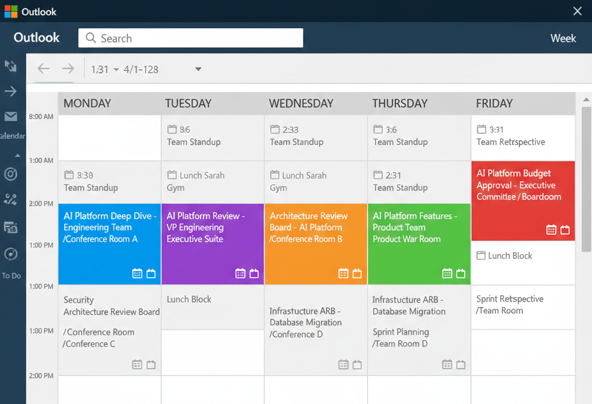

# The Technical Presentation Playbook: How to Tailor Your Message to Every Audience

Part 3 of my series on Technical Communication. Last time, we talked about stakeholder dynamics — specifically, how to handle it when executives disagree right in front of you. This time: presenting the same technical project to five wildly different audiences without completely bombing. Stick around for more communication strategies that actually work in the real world.

## The Five-Audience Problem

You've got an agentic AI development platform to present. Same architecture. Same technical decisions. Same business outcomes.

But here's your week:

Monday afternoon, you're in a conference room with 20 developers who want to understand how the system works under the hood. Tuesday, you're presenting to the VP of Engineering who needs to know if this will help her team ship faster. Wednesday, you're facing the architecture review board who will scrutinize every technical decision. Thursday, the product team wants to know what new features this enables. Friday morning, you're in the boardroom with the CEO, CFO, and CTO who need to approve the budget.

Use the same presentation for all five? You'll fail with at least four of them.

I learned this lesson the expensive way. Presented a PostgreSQL migration to the executive team using the exact same deck I'd shown engineering. Thirty slides of StatefulSet configurations, persistent volume claims, and CloudNativePG operator architecture diagrams showing how we'd migrate from AWS RDS to a self-managed PostgreSQL cluster running in Kubernetes.

The CEO stopped me on slide 3: "I don't care about operators. Will this reduce our database costs or not?"

The CFO on slide 5: "How much will this migration cost and when will we see ROI?"

The CTO on slide 7: "What's the risk if the cluster fails? Do we have a rollback plan?"

Never made it past slide 7. Complete disaster.

The problem wasn't the technical content. The problem was speaking Kubernetes to people who needed to hear business outcomes, risk mitigation, and strategic value.

Here's what I learned about tailoring technical presentations to different audiences — using our agentic AI platform as the example.

## The Project: Agentic AI Development Platform

Before we get into the five presentations, let me give you some context. We're building a platform that lets teams develop AI agents without reinventing the wheel every single time. Think of it as the infrastructure layer that handles orchestration, state management, model routing, and observability so developers can focus on building agent behaviors instead of plumbing.

The technical stack? LangGraph for multi-agent orchestration, Pinecone for vector-based retrieval, LiteLLM as an intelligent gateway to multiple LLM providers, and PostgreSQL running in Kubernetes for state management. We migrated the database from AWS RDS to an in-cluster deployment using the CloudNativePG operator because the latency and cost savings were too significant to ignore.

From a business perspective, this platform reduces AI feature development time from six weeks to two weeks, cuts our AI API costs by 60% through intelligent caching and model routing, and enables teams that don't have deep AI expertise to build sophisticated agent workflows. It scales from handling 10 concurrent agents during development to 10,000 in production, and it provides the audit trails we need for compliance.

Same project. Five completely different ways to present it.

## Audience #1: Engineering Team

Engineers are your technical peers. They want to understand how the system actually works, what technologies you chose and why, and how this will affect their day-to-day development workflow. They're not impressed by business metrics or executive-speak — they want to see code, architecture diagrams, and honest discussions about tradeoffs.

**What to Cover** (45 minutes):

🔹 **The Problem** (5 min)
- Every team building their own agent frameworks
- Duplicated effort solving the same problems
- Show actual code examples of the duplication

🔹 **Architecture Deep Dive** (15 min)
- LangGraph orchestration with real code examples
- Pinecone vector database integration
- LiteLLM gateway for model routing
- PostgreSQL state management architecture
- Observability stack (OpenTelemetry, Jaeger, Prometheus)

🔹 **PostgreSQL Migration Details** (10 min)
- Why move from RDS to in-cluster (4x latency improvement, cost savings)
- CloudNativePG operator architecture
- High availability with 3-node cluster across 3 AZs
- Backup strategy with WAL-G archiving to S3
- Performance: local NVMe vs network-attached EBS

🔹 **Developer Experience** (10 min)
- Code walkthrough: building a simple agent
- API examples with Python/TypeScript
- Local development setup
- Testing and debugging workflows
- Migration path for existing agents

🔹 **Tradeoffs Discussion** (5 min)
- Why LangGraph over LangChain (explicit state management)
- Why Pinecone over Weaviate (managed service, less ops burden)
- Why in-cluster PostgreSQL over RDS (latency, cost, control)

**Handling Pushback**: Engineers will challenge your technical decisions, and that's actually healthy. When someone asks "Why not use technology X instead of Y?", don't get defensive. Acknowledge the alternative is valid and explain your reasoning: "We considered X, and it has advantages in areas A and B, but we chose Y because of constraints C and D." If someone points out a potential problem you haven't considered, thank them and commit to investigating it. Engineers respect honesty and intellectual humility way more than they respect being right all the time.

## Audience #2: VP Engineering

Your VP of Engineering operates at a completely different altitude — she's not concerned with how LangGraph manages state or why you chose Pinecone over Weaviate. She needs to know if this platform will help her team ship faster, what resources it requires, and whether it will disrupt current delivery commitments.

**What to Cover** (30 minutes, but be ready for 10):

🔹 **The Bottom Line** (2 min)
- 67% faster AI feature development (6 weeks → 2 weeks)
- 3x more AI features with same team size
- 60% reduction in AI infrastructure costs

🔹 **The Problem** (3 min)
- Teams spending 80% time on infrastructure, 20% on features
- AI costs growing 40% month-over-month ($300K → $420K)
- No standardization = no knowledge sharing
- Competitors shipping AI features 3x faster

🔹 **The Solution** (5 min)
- Centralized platform with self-service (no bottlenecks)
- Built-in cost optimization and observability
- Proven patterns and best practices
- Gradual migration, no disruption to current roadmaps

🔹 **Resource Requirements** (5 min)
- 2 platform engineers for 6 months
- $50K infrastructure costs
- $180K annual savings (net positive)

🔹 **Timeline** (5 min)
- Months 1-2: Core platform (MVP)
- Months 3-4: First 3 teams onboarded
- Months 5-6: Full rollout
- Month 7+: Realize full benefits

🔹 **Risk Mitigation** (5 min)
- Parallel run with existing systems (no single point of failure)
- Starting with 3 eager pilot teams
- Clear success metrics with course-correction plan

🔹 **Success Metrics** (3 min)
- Development velocity (story points per sprint)
- AI feature adoption (features shipped per quarter)
- Cost reduction (AI API spend)
- Developer satisfaction (survey scores)

🔹 **Q&A** (2 min)

**Time Constraints Reality**: Here's the truth about presenting to VPs: that 30-minute meeting might become 10 minutes. She might be running late from another meeting, or get pulled into an emergency halfway through. Always have a 10-minute version ready. Lead with the three key numbers (67% faster development, 3x more features, 60% cost reduction), the resource ask ($150K, 2 engineers, 6 months), and the timeline. If you only get 10 minutes, you need those numbers and the ask. Everything else? Supporting detail you can send in a follow-up email.

**Handling Pushback**: When the VP pushes back, it's usually about resources or risk. If she says "I don't have two engineers to spare," have alternatives ready: can you borrow one engineer and hire a contractor? Can you extend the timeline to four months with one engineer? If she's concerned about risk to current commitments, emphasize the parallel run strategy and gradual migration. The key is showing flexibility while maintaining the core value proposition. Don't get defensive — treat pushback as a request for more information or alternative approaches.

## Audience #3: Architecture Review Board

The architecture review board is where your technical decisions get scrutinized by senior architects who've seen a lot of systems succeed and fail. They care about architectural soundness, scalability, security, and whether your design will still make sense in three years.

**What to Cover** (60 minutes):

🔹 **Context** (3 min)
- Current state: Fragmented agent implementations
- Proposed state: Unified platform
- Alignment with enterprise architecture principles

🔹 **Architecture Overview** (10 min)
- High-level system architecture
- Component responsibilities and boundaries
- Data flow diagrams
- Integration points with existing systems

🔹 **Component Deep Dives** (15 min)
- Agent orchestration: LangGraph state management and execution graphs
- Vector database: Pinecone architecture and why managed service
- LLM gateway: LiteLLM routing, fallbacks, cost optimization
- State management: PostgreSQL architecture
- Observability: OpenTelemetry, Jaeger, Prometheus integration

🔹 **PostgreSQL Migration Architecture** (10 min)
- Why migrate from RDS to in-cluster
- CloudNativePG operator architecture
- 3-node cluster with synchronous replication across 3 AZs
- Automated failover and connection pooling (PgBouncer)
- Backup strategy: WAL-G archiving to S3
- Performance: local NVMe vs EBS (4x latency improvement)
- Cost analysis: $2K/month self-managed vs $5K/month RDS
- Operational considerations and tradeoffs

🔹 **Scalability and Performance** (8 min)
- Horizontal scaling strategy (10 → 10,000 concurrent agents)
- Auto-scaling policies
- Performance benchmarks
- Capacity planning
- Cost optimization techniques

🔹 **Security and Compliance** (8 min)
- Authentication and authorization
- Data encryption (at rest and in transit)
- Audit logging
- SOC2 and GDPR compliance
- Secrets management (Vault integration)

🔹 **Operational Considerations** (8 min)
- Deployment strategy (gradual rollout)
- Monitoring and alerting
- Incident response procedures
- Disaster recovery (RTO/RPO targets)
- SLA commitments

🔹 **Alternatives Considered** (5 min)
- Why LangGraph over LangChain
- Why Pinecone over Weaviate
- Why in-cluster PostgreSQL over RDS
- Why containers over serverless

🔹 **Q&A and Technical Discussion** (3 min)

**Handling Pushback**: Architecture review boards will challenge your decisions, and they should. When an architect questions your approach, they're usually testing whether you've thought through the implications. If someone says "This won't scale past 10,000 users," show your scaling analysis and benchmarks. If they're right and you haven't considered that scenario, acknowledge it and explain how you'll address it. The board isn't trying to kill your project — they're trying to prevent future problems. Treat their concerns as valuable input, not obstacles. If you can't answer a question, say so and commit to following up with analysis.

## Audience #4: Product Team

Product managers think in terms of features, user experiences, and competitive positioning. They don't care about your database architecture or which operator you're using — they care about what new capabilities this platform enables and how quickly they can ship features to users.

**What to Cover** (30 minutes):

🔹 **The Opportunity** (2 min)
- AI agents enable 10x faster feature development
- Competitors shipping AI features 3x faster than us
- This platform closes the gap

🔹 **What This Enables** (5 min)
- Personalized user experiences at scale
- Automated workflows (eliminate manual work)
- Intelligent recommendations and insights
- 24/7 customer support with AI agents

🔹 **Feature Examples with Mockups** (8 min)
- Intelligent document processing: 6 weeks → 2 weeks
- Personalized onboarding assistant: 4 weeks → 1 week
- Automated compliance checking: 8 weeks → 3 weeks
- Show mockups and user flows, not architecture diagrams

🔹 **Impact on Product Roadmap** (5 min)
- Without platform: 1 AI feature per quarter (4 per year)
- With platform: 3 features in Q2, 5 in Q3, 8 in Q4 (20 per year)
- Enables features that were previously "too expensive"

🔹 **User Experience Improvements** (5 min)
- Faster response times (2s → 500ms)
- More accurate results (70% → 95% accuracy)
- Personalized experiences
- Seamless integration with existing workflows

🔹 **Competitive Analysis** (3 min)
- Competitor A: Ships AI features monthly, 15 features live
- Competitor B: Has AI-powered everything
- Us (current): Ships quarterly, 4 features total
- Us (with platform): Ships bi-weekly, 20+ features by EOY

🔹 **Q&A** (2 min)

**Handling Pushback**: Product managers will push back on timelines and feasibility. If someone says "Two weeks per feature sounds too good to be true," show them the actual example: the document processing feature that took six weeks before and two weeks with the platform. Break down where the time savings come from: four weeks of infrastructure work eliminated, leaving only two weeks of feature-specific development. If they're skeptical about the 20+ features by end of year, walk through the math: three features in Q2, five in Q3, eight in Q4, plus the four you already have. The key is having concrete examples and clear math to back up your claims.

## Audience #5: Executive Steering Committee

The executive steering committee — CEO, CFO, CTO — operates at the highest level of abstraction, making resource allocation decisions across the entire company. They need to understand strategic value, financial impact, and risk in minutes, not hours.

**What to Cover** (20 minutes, but be ready for 5):

🔹 **The Ask** (1 min)
- Approve $150K investment in AI development platform
- Allocate 2 platform engineers for 6 months
- Expected ROI: $500K annual benefit

🔹 **The Problem** (2 min)
- AI development too slow (6 weeks per feature)
- AI costs growing 40% month-over-month ($300K → $420K)
- Competitors shipping AI features 3x faster
- Teams duplicating effort, no economies of scale

🔹 **The Solution** (2 min)
- Centralized AI development platform
- Reduces development time by 67%
- Cuts AI costs by 60%
- Enables 4x more AI features with same team

🔹 **Financial Impact** (3 min)
- Cost savings: $180K/year (AI infrastructure optimization)
- Revenue opportunity: $320K/year (faster feature delivery)
- Total benefit: $500K/year
- Investment: $150K (platform + 6 months engineering)
- ROI: 233% in year 1, payback in 4 months

🔹 **Strategic Value** (3 min)
- Competitive positioning: Close AI feature gap
- Market differentiation: AI-powered experiences at scale
- Operational efficiency: 3x more features with same team
- Future-proofing: Platform for next-gen AI capabilities

🔹 **Risk Assessment** (3 min)
- Technical risk: LOW (proven technologies, gradual rollout)
- Delivery risk: LOW (no impact to current commitments)
- Financial risk: LOW ($150K investment, $500K upside)
- Competitive risk: HIGH (if we don't do this, competitors pull ahead)

🔹 **Timeline** (2 min)
- Month 1-2: Build core platform
- Month 3-4: Onboard first 3 teams
- Month 5-6: Full rollout
- Month 7: Realize full benefits

🔹 **Recommendation** (2 min)
- Approve $150K investment
- Allocate 2 platform engineers
- Target launch: Q2 2025
- Expected benefits: $500K annual value

🔹 **Q&A** (2 min)

**Time Constraints Reality**: Executive meetings are notorious for running short. You might have 20 minutes scheduled, but the CEO might walk in 10 minutes late, or the CFO might need to leave early for another meeting. Always be prepared to deliver your entire presentation in 5 minutes. That means: the ask ($150K for AI platform), the benefit ($500K annual value), the timeline (6 months to full rollout), and the risk (low, gradual rollout with parallel run). Everything else — the problem statement, the detailed financials, the strategic value — those are supporting details you can cover if you have time or send in a follow-up deck.

I've had executive presentations where I got through slide 1 (the ask) and slide 4 (financial impact) before someone said "Approved, send us the details." I've also had presentations where we spent the full 20 minutes drilling into risk scenarios. Be ready for both.

**Handling Pushback**: Executive pushback usually comes in three flavors: financial skepticism, strategic misalignment, or risk concerns. If the CFO questions your $500K benefit projection, break it down: $180K from cost savings (show the current AI spend and projected spend), $320K from revenue opportunity (show the features you can ship and their expected impact). If the CEO says "This doesn't align with our AI strategy," you've done your homework wrong — you should've understood the strategy before presenting. Acknowledge the concern and ask how you can adjust the proposal to align better. If the CTO is worried about technical risk, emphasize the gradual rollout, the parallel run strategy, and the proven technologies. Never argue with executives — if they're pushing back, either you haven't explained clearly or you need to adjust your proposal.

## The Pattern: Audience-First Thinking

After presenting the same project to five different audiences, a pattern emerges. The key to effective technical presentations isn't having more slides or better graphics — it's understanding what each audience cares about and structuring your entire presentation around their concerns. When you're presenting to engineers, you're speaking to people who want to understand the system deeply enough to build on it or maintain it. When you're presenting to executives, you're speaking to people who need to allocate resources across dozens of competing priorities and need to understand strategic value in minutes, not hours. These are fundamentally different conversations, and trying to have both conversations with the same presentation is like trying to use a screwdriver as a hammer — technically possible but deeply ineffective.

**The Three-Part Framework**:

🔹 **Identify What They Care About**
- Engineers: How it works (code, architecture, tradeoffs)
- Managers: Impact on their team (velocity, resources, timeline)
- Architects: Soundness and scalability (patterns, non-functional requirements)
- Product: Features and user experience (capabilities, competitive positioning)
- Executives: Business value and risk (ROI, strategy, resource allocation)
- Structure your presentation to address their primary concern first, not last

🔹 **Use Their Language**
- Engineers: Code examples, architecture patterns, technical tradeoffs
- Managers: Metrics, timelines, resource allocation, team impact
- Architects: Design patterns, scalability analysis, quality attributes
- Product: Features, user outcomes, competitive positioning, market impact
- Executives: ROI, strategic value, risk assessment, business outcomes
- Using the wrong language signals you don't understand their world

🔹 **Adjust Detail Level to Match Their Needs**
- Engineers: Deep technical details (they'll be working with the system)
- Managers: Team-level impact (how this affects their people and delivery)
- Architects: Architectural details without implementation specifics
- Product: Feature-level details without technical implementation
- Executives: High-level outcomes (they're making resource allocation decisions)
- Getting the detail level wrong is one of the fastest ways to lose your audience

**The Pre-Presentation Checklist**:

Before any presentation, answer these five questions:
- Who is in the room? (roles, technical background, decision authority)
- What do they care about most? (their top 3 concerns)
- What decision are they making? (approve budget, technical direction, resource allocation)
- What questions will they ask? (prepare answers for predictable questions)
- What would make them say yes? (understand their success criteria)

If you can't answer these questions, you're not ready to present.

## Common Mistakes to Avoid

I've seen these mistakes kill presentations that should've succeeded. The most common? Using the same deck for everyone — building a comprehensive technical presentation for the architecture review board, then using that same deck for executives. The result is predictable: executives check out after three slides of technical details, and you never get to the business value that would've convinced them. Each of these mistakes is avoidable if you know what to watch for.

**The Five Fatal Mistakes**:

🔹 **Using the Same Deck for Everyone**
- Building one comprehensive deck and presenting it to all audiences
- Result: Executives get bored with technical details, engineers get frustrated with high-level fluff
- Solution: Create audience-specific versions, not one-size-fits-all

🔹 **Leading with Technical Details Instead of Outcomes**
- Starting with your technology stack before explaining the business value
- Engineers might tolerate this, but everyone else needs to understand the why first
- If you're presenting to executives and start with your architecture, you've already lost
- Solution: Lead with the business outcome, then work backward to technical approach if asked

🔹 **Assuming Technical Knowledge**
- Not everyone knows what Kubernetes is, what a vector database does, or why you'd run PostgreSQL in a container
- Using jargon without defining terms alienates non-technical audiences
- Solution: For mixed audiences, define your terms or avoid jargon entirely
- Goal is communication, not demonstrating your technical vocabulary

🔹 **Ignoring the "So What?"**
- Explaining your architecture beautifully without connecting it to outcomes
- Technical details without business context are just trivia
- Solution: Always answer the implicit question "Why should I care about this?"
- Connect every technical decision to a business outcome or user benefit

🔹 **Not Preparing for Predictable Questions**
- Every audience type has predictable concerns and questions
- Engineers will ask about tradeoffs, executives will ask about ROI, architects will ask about scalability
- Getting caught off-guard by obvious questions damages credibility
- Solution: Prepare answers for the top 5 questions each audience type will ask

## Real-World Example: The PostgreSQL Migration

Let me show you how I presented the same PostgreSQL migration to three different audiences after learning these lessons.

**To Engineering** (45 minutes):
- CloudNativePG operator architecture deep dive
- StatefulSet configurations and persistent volume claims
- Backup and restore procedures with WAL-G
- Performance benchmarks: local NVMe vs EBS
- Migration runbook with rollback procedures
- Monitoring and alerting setup
- Actual configuration files they could reference

**To Architecture Review** (60 minutes):
- High availability architecture (3 nodes, 3 AZs, sync replication)
- Disaster recovery strategy (WAL archiving to S3)
- Security considerations (encryption, network policies)
- Scalability analysis (connection pooling, read replicas)
- Comparison with RDS (latency, cost, control, ops complexity)
- Integration with existing backup systems
- Compliance requirements (audit logging, data retention)

**To Executives** (10 minutes):
- Cost reduction: $36K/year savings ($5K/month RDS → $2K/month self-managed)
- Performance improvement: 4x faster queries (2ms vs 8ms latency)
- Risk mitigation: Same HA guarantees as RDS, tested failover
- Timeline: 2-week migration with zero downtime
- Recommendation: Approve migration, start in 2 weeks

Same migration. Three completely different presentations. All successful because each one was tailored to what that audience needed to hear.

---

**Key Takeaways**:
- Same project, different audiences = different presentations
- Lead with what they care about, not what you're proud of
- Use their language: technical for engineers, business for executives
- Adjust detail level: deep for architects, high-level for executives
- Prepare for predictable questions from each audience type
- One size fits none — tailor every presentation

**Action Items**:
1. Identify your next presentation's audience
2. List their top 3 concerns
3. Restructure your deck to address those concerns first
4. Remove jargon they won't understand
5. Prepare answers to their likely questions
6. Practice with someone from that audience type

---

## Tools and Resources

**Presentation Tools**:
- [Marp](https://marp.app/): Markdown-based presentation tool
- [reveal.js](https://revealjs.com/): HTML presentation framework
- [Pitch](https://pitch.com/): Collaborative presentation software

**Communication Resources**:
- [Presentation Zen](https://www.presentationzen.com/): Presentation design principles
- [Speaking.io](https://speaking.io/): Public speaking guide for developers

---

## What's Next

In Part 4, we'll explore Technical Writing for Non-Technical Audiences: how to write documentation, proposals, and reports that executives actually read and act on.

---

## Series Navigation

**Previous Article**: [When Executives Disagree in Front of You: A Technical Guide to Stakeholder Dynamics](#) *(Part 2)*

**Next Article**: [Technical Writing for Non-Technical Audiences](#) *(Coming soon!)*

**Coming Up**: Executive summary formula, writing for scanners, visual documentation, one-page proposals

---

*Daniel Stauffer is an Enterprise Architect specializing in technical communication and stakeholder management. He's given hundreds of technical presentations and learned most of these lessons the hard way.*

#TechnicalCommunication #PresentationSkills #ExecutiveCommunication #StakeholderManagement #EngineeringLeadership #TechnicalLeadership #SoftwareArchitecture #AgenticAI #Kubernetes #PostgreSQL
