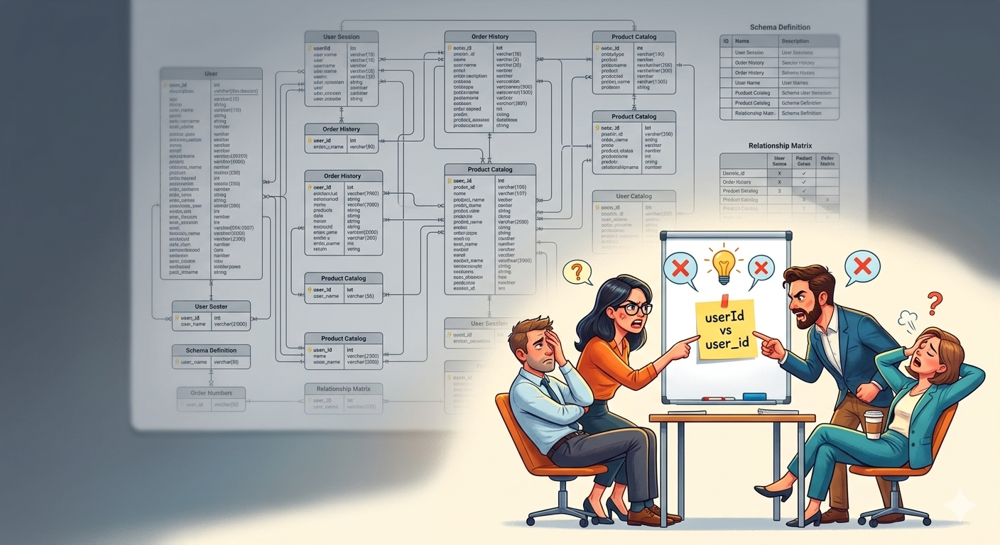

# Teams Post — The Design Review Playbook

**Channel**: Jabil Developer Network — Architecture Community
**Subject Line**: Your design review just became a 2-hour database debate. Nobody's facilitating. Everyone's advocating.
**Featured Image**: `images/featured_image.png`
**Article URL**: https://medium.com/gitconnected/the-design-review-playbook-facilitating-technical-discussions-that-actually-work-ae1a3d8694f4

---

## The Pattern That Kills Design Reviews

Two senior engineers arguing about MongoDB vs PostgreSQL for 30 minutes. A junior engineer sitting there with a frozen pen. No decisions made. "Let's schedule a follow-up."

12 person-hours. ~$1,800 wasted. Zero outcomes.

The problem is almost always the same: nobody is facilitating. Everyone is advocating for their preferred approach.

## What the Article Covers

- **4 types of design reviews** (Requirements, Preliminary, Detailed, Final) and when each one matters
- **5 patterns that reliably kill reviews** — bikeshedding, loud voices, analysis paralysis, design by committee, missing context
- **Decision frameworks** that actually close discussions — consensus vs consent vs DACI
- **The hardest scenario**: when you're both the presenter and the facilitator, and how to separate those roles cleanly

The key insight: facilitating is fundamentally different from presenting. You're guiding the process, not pushing an outcome. Once you internalize that distinction, reviews get shorter and produce actual decisions.

**Part 5 of the Technical Communication series** — [Read the full article](https://medium.com/gitconnected/the-design-review-playbook-facilitating-technical-discussions-that-actually-work-ae1a3d8694f4)
