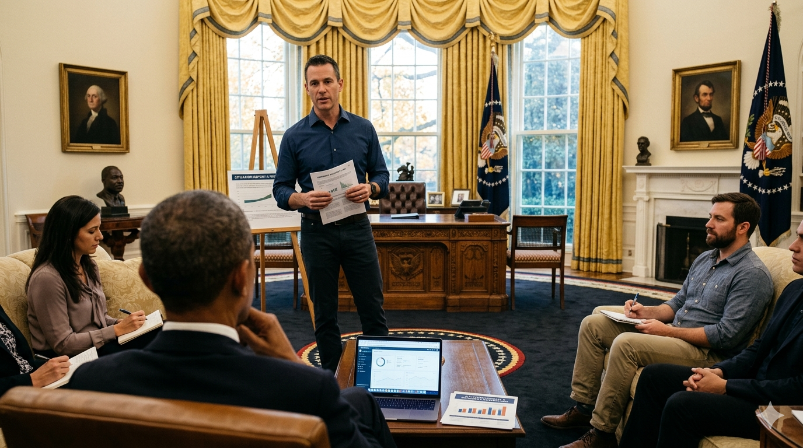

# Teams Post — The HealthCare.gov Rescue: Capstone Case Study

**Channel**: Jabil Developer Network — Architecture Community
**Subject Line**: $840 million. 55 contractors. 6 enrollments on launch day. The rescue team's edge wasn't technical — it was how clearly they communicated under pressure.
**Featured Image**: `images/featured_image.png`
**Article URL**: [TO BE ADDED AFTER PUBLICATION]

---

## Every Communication Skill in One Crisis

HealthCare.gov launched October 1, 2013. $840M spent across 55 contractors. 4.7 million visitors on day one. Six successful enrollments. A small team of engineers from Google, Oracle, and Red Hat had 60 days to fix it — while briefing the White House, navigating contractor politics, and working under congressional scrutiny.

## Why This Case Study Matters for Us

The rescue team used every communication technique from this 9-part series in a single 60-day crisis:

- **Executive briefings** to the President using the Pyramid Principle
- **Stakeholder navigation** between CMS, contractors, and the White House
- Daily war rooms where engineers presented to political staff who didn't share their vocabulary
- **Architecture reviews** of a system nobody fully understood
- Triaging 200+ critical bugs against a hard deadline
- **Technical writing** for lawyers and government administrators
- Convincing political staff that "just fix it" wasn't a strategy — technical debt needed a real conversation
- **Cross-functional collaboration** across Silicon Valley and government cultures that had almost nothing in common

By December 1: 50,000 concurrent users (up from 1,100). 800,000+ enrollments in December. The team became the US Digital Service.

The engineers who saved it were technically sharp, sure. But the reason they succeeded where 55 contractors failed? They knew how to talk to a room full of people who didn't think like them.

**Part 9 — Series Capstone** — [Read the full case study](ARTICLE_URL)
