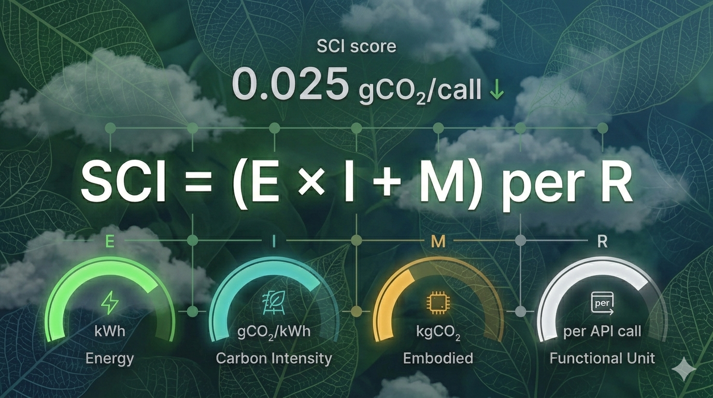

# Teams Post — ISO/IEC 21031: Software Carbon Intensity

**Channel**: Jabil Developer Network — Architecture Community
**Subject Line**: There's now an ISO standard for measuring your software's carbon footprint. One equation. Offsets don't count.
**Featured Image**: `images/featured_image.png`
**Article URL**: [TO BE ADDED AFTER PUBLICATION]

---

## The Measurement Gap

You optimized your algorithms, fixed your database queries, right-sized your containers. Your cloud bill dropped. But did your carbon footprint actually go down? By how much?

Most of us can't answer that. The GHG Protocol gives annual totals — useful for sustainability reports, useless for sprint planning.

## One Equation

ISO/IEC 21031:2024 (the SCI specification) boils it down to:

**SCI = (E × I + M) per R**

Energy consumed × grid carbon intensity + embodied hardware emissions, per functional unit of your software. It's a rate — "0.025 gCO₂ per API call" — not an annual total. And offsets are explicitly excluded.

## Why This Matters for Us

Autostrade per l'Italia measured 60 applications and averaged 15.1% CO₂ savings. Some fixes took 4 person-days per app. That's ROI that doesn't need a sustainability argument.

The article walks through calculating your first SCI score step by step, with working Python code and a script that pulls carbon intensity data automatically.

**Series finale (Part 9 of Sustainable Software Engineering)** — [Read the full article](ARTICLE_URL)
