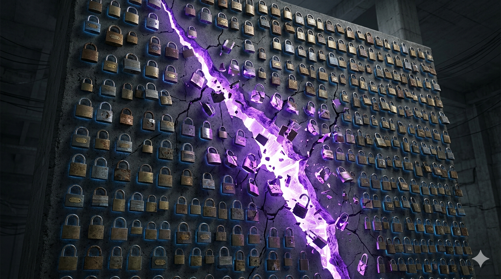

# Teams Post — Why Architects Need to Think About Quantum Now

**Channel**: Jabil Developer Network — Architecture Community
**Subject Line**: Your RSA encryption has an expiration date. Adversaries are already storing your encrypted traffic, waiting for the quantum computer that can read it.
**Featured Image**: `images/featured_image.png`
**Article URL**: https://medium.com/@the-architect-ds/why-architects-need-to-think-about-quantum-now-even-though-its-not-ready-yet-e1706a5b055e

---

## The Encryption Expiration Date

Somewhere between 2029 and 2035, quantum computers are expected to break RSA, ECC, and Diffie-Hellman — the foundations of TLS, SSH, VPN, and most API authentication. NIST finalized post-quantum cryptography standards in August 2024. Chrome already ships hybrid PQC by default. The standards side is largely settled, though actual migration paths vary a lot depending on your stack.

The urgent part: nation-state actors are already running "harvest now, decrypt later" operations — storing encrypted traffic today for future quantum decryption. CISA estimates over 50% of nation-state actors are doing this.

## What This Means for Jabil

If we handle regulated data (financial, healthcare, government contracts), our PQC migration timeline is already running. The article covers:

- **What breaks** — RSA, ECC, DH, DSA (our TLS, SSH, VPN, API auth)
- **What survives** — AES-256 gets weakened but holds; SHA-256 is fine
- **What "quantum-ready" actually looks like** — CBOM audit, PQC migration plan, a pilot project to pressure-test the tooling
- **The cost math** — $200K-$2M migration vs. $50M-$500M Q-Day exposure
- **Quantum landscape** — where IBM, Google, IonQ, Amazon Braket, and Microsoft stand right now

First step: start a Cryptographic Bill of Materials (CBOM) audit. Inventory what crypto we're using across our stack.

**Part 0 of The Quantum-Centric Architect series** — [Read the full article](https://medium.com/@the-architect-ds/why-architects-need-to-think-about-quantum-now-even-though-its-not-ready-yet-e1706a5b055e)
