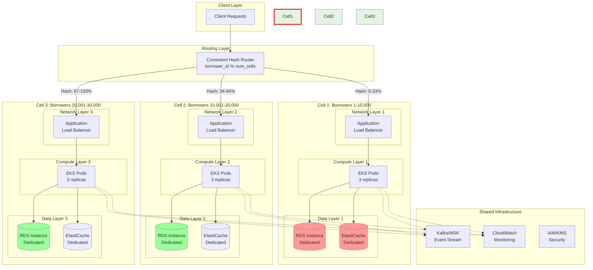
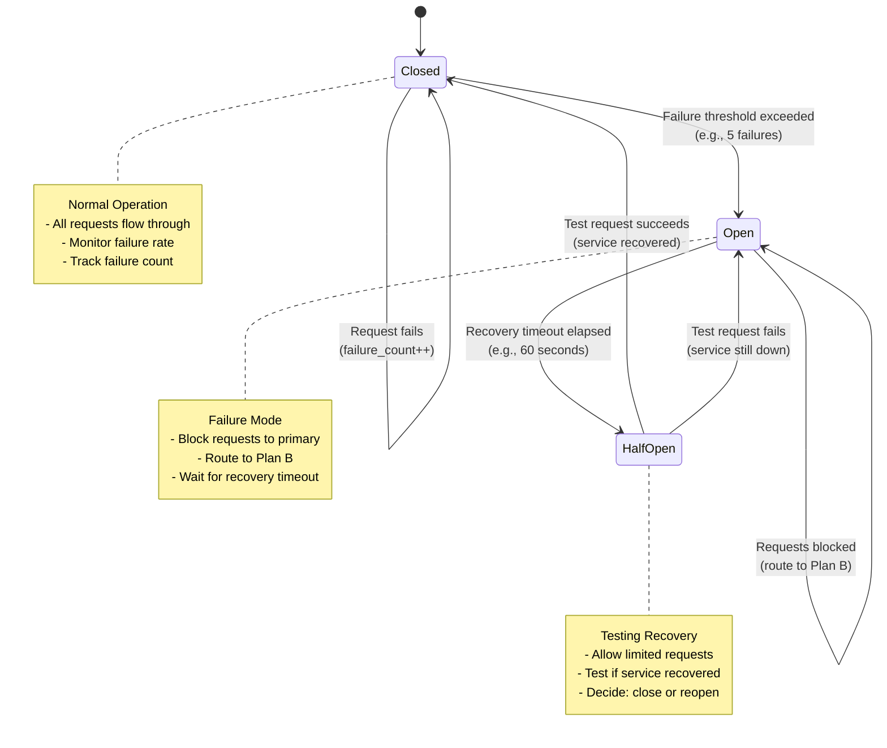
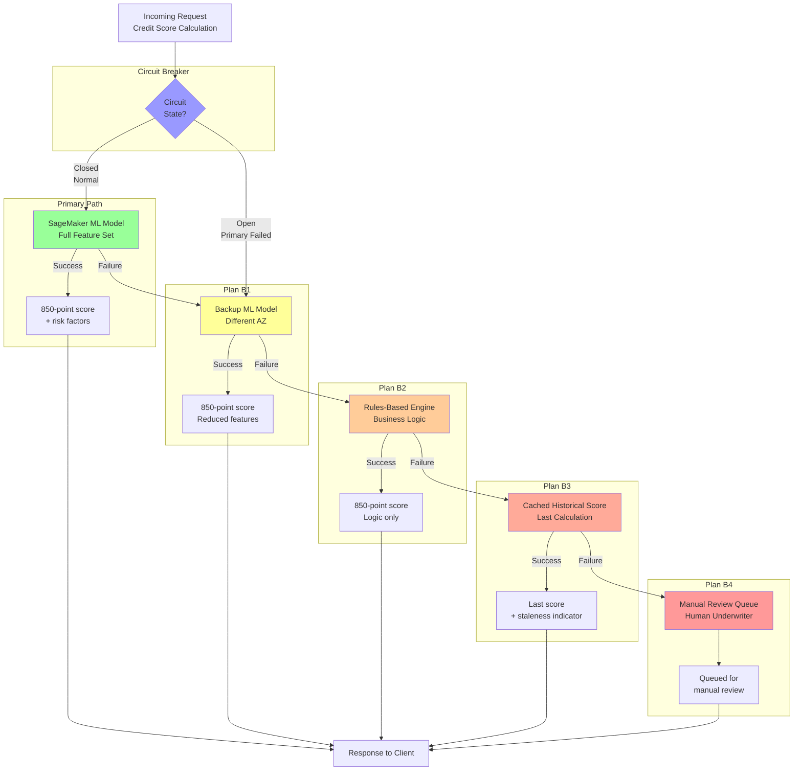
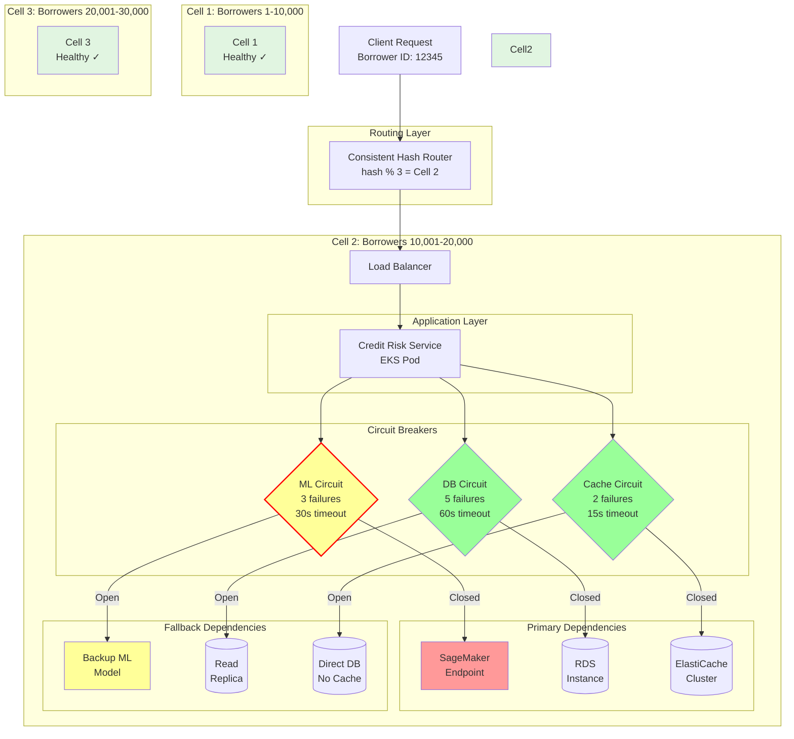
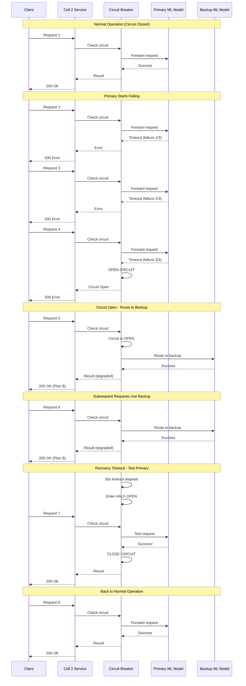

# Architecture Diagrams: Cell-Based Architecture with Circuit Breakers

## Diagram 1: Cell-Based Architecture Overview

**Key Points:**
- Each cell is completely isolated with dedicated resources
- Consistent hashing routes requests deterministically
- Cell 1 failure (red) doesn't affect Cell 2 and Cell 3 (green)
- Shared infrastructure sits below cells for cross-cutting concerns

---

## Diagram 2: Circuit Breaker State Machine

**State Transitions:**
- **Closed → Open**: Too many failures (threshold exceeded)
- **Open → Half-Open**: Recovery timeout elapsed, test if service recovered
- **Half-Open → Closed**: Test successful, service recovered
- **Half-Open → Open**: Test failed, service still down

---

## Diagram 3: Circuit Breaker with Fallback Routing (Plan B)

**Fallback Hierarchy:**
1. **Primary**: Full ML model (best accuracy, highest latency)
2. **Plan B1**: Backup ML model (good accuracy, medium latency)
3. **Plan B2**: Rules engine (acceptable accuracy, low latency)
4. **Plan B3**: Cached score (stale but fast)
5. **Plan B4**: Manual queue (slowest but always works)

**Key Principle**: Never return an error. Always provide *something*.

---

## Diagram 4: Complete System - Cells + Circuit Breakers

**System Behavior:**
- Request routed to Cell 2 via consistent hashing
- ML Circuit is OPEN (red) → routes to backup ML model
- DB Circuit is CLOSED (green) → uses primary database
- Cache Circuit is CLOSED (green) → uses primary cache
- Cell 1 and Cell 3 unaffected by Cell 2's ML issues

---

## Diagram 5: Cascading Failure Prevention

**Timeline:**
1. **Requests 1**: Normal operation, circuit closed
2. **Requests 2-4**: Primary fails, circuit tracks failures, opens after threshold
3. **Requests 5-6**: Circuit open, all requests route to backup (no cascading failure!)
4. **Request 7**: Recovery timeout, circuit tests primary, succeeds, closes circuit
5. **Request 8+**: Back to normal operation

**Key Insight**: Circuit breaker prevents cascading failures by stopping requests to failing service and routing to backup. System stays available throughout.

---

## Usage in Article

Insert these diagrams at the following sections:

1. **Diagram 1** → After "What Makes a Cell?" section
2. **Diagram 2** → After "The Three States" section
3. **Diagram 3** → After "Plan B: Never Shut Down, Always Route" section
4. **Diagram 4** → After "Real-World Application: Credit Risk Assessment" section
5. **Diagram 5** → After "The Problem: Cascading Failures Are Expensive" section

## Rendering

These diagrams use Mermaid syntax and can be rendered:
- **Medium**: Use image export from Mermaid Live Editor (https://mermaid.live)
- **GitHub**: Native Mermaid rendering in markdown
- **Documentation**: Most modern doc platforms support Mermaid

## Export Instructions

1. Copy diagram code to https://mermaid.live
2. Adjust styling/colors as needed
3. Export as PNG or SVG
4. Upload to Medium article
5. Add alt text describing the diagram for accessibility
