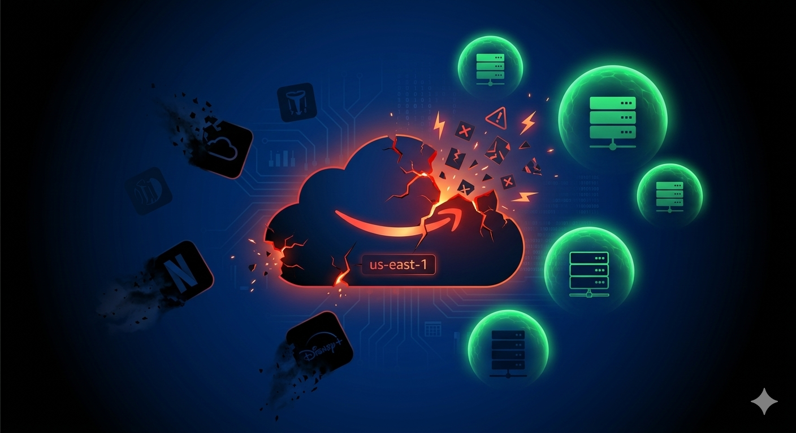

# Teams Post — The Day AWS Went Down

**Channel**: Jabil Developer Network — Architecture Community
**Subject Line**: December 7, 2021. AWS us-east-1 goes down. Netflix dies. Amazon.com keeps selling. Why?
**Featured Image**: `images/featured_image.png`
**Article URL**: https://medium.com/gitconnected/the-day-aws-went-down-building-systems-that-survive-infrastructure-apocalypse-208268d094b5

---

## Your "Multi-Region" Architecture Probably Has Hidden us-east-1 Dependencies

When us-east-1 went down for 5 hours, it took Netflix, Disney+, and Robinhood with it. $100M+ in losses. But Amazon.com kept selling.

The difference wasn't budget. It was architecture. Most "multi-region" setups have invisible dependencies on us-east-1 — IAM lives there, control plane APIs route through there, and your token refresh breaks about an hour after the outage starts.

## The Cost Math

| Strategy | Monthly Cost | Failover Time |
|----------|-------------|---------------|
| Active-Active | $22-25K | Instant |
| Active-Passive | $13K | 5-60 min |
| Single Region | $10K | Hours to days |

If downtime costs you $100K/hour, multi-region pays for itself after 6 minutes of prevented downtime per month. If it costs $10K/hour, break-even is 1 hour.

Most teams should focus on good backups and fast recovery before investing in multi-region. The article walks through the real disasters (AWS, OVH datacenter fire, Azure DNS, GCP networking), replication strategies, and how to figure out what actually makes sense for your setup.

**Part 5 of the Resilience Engineering series** — [Read the full article](https://medium.com/gitconnected/the-day-aws-went-down-building-systems-that-survive-infrastructure-apocalypse-208268d094b5)
