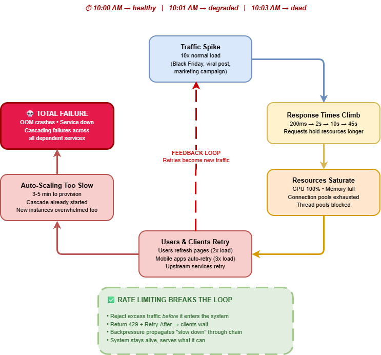
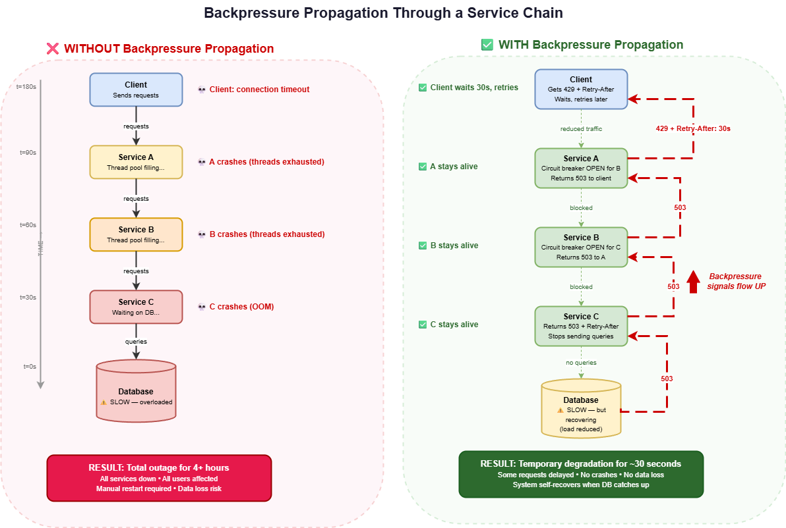
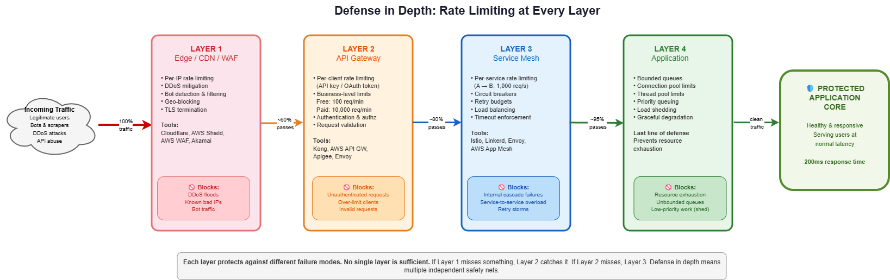

# Rate Limiting and Backpressure: Protecting Systems from Themselves

Part 6 of my series on Resilience Engineering. Last time, we explored [multi-region architecture and surviving infrastructure apocalypse](link) — what happens when AWS goes dark and some companies keep running while others lose millions. This time: what happens when your own success kills you, and how to build systems that protect themselves from overwhelming traffic. Follow along for more deep dives into building systems that don't fall apart.

## Killed by Success

Black Friday 2018. Walmart.com starts buckling under a massive traffic surge as online shopping numbers hit record highs. Nothing is broken. No bugs, no crashes, no failed deployments. Just too much.

Shoppers see error pages. Checkout flows stall. Carts empty themselves mid-purchase. Response times climb from milliseconds to seconds to timeouts. Users start refreshing pages, which doubles the load. Mobile apps retry failed requests automatically, tripling it. The load balancer keeps accepting connections because the servers are technically "healthy" — they're responding, just slowly. Connection pools fill up. Queries start queuing. The queue grows unbounded until services buckle under the weight.

An estimated [3.6 million shoppers were affected](https://www.retailtouchpoints.com/news/site-outages-plague-walmart-j-crew-lowe-s-best-buy-office-depot-during-black-friday-weekend/20823/). Analysts at LovetheSales.com pegged the damage at roughly $9 million in lost sales — and that's just Walmart. [Lowe's, J.Crew, Best Buy, and Office Depot all suffered similar outages](https://www.businessinsider.com/walmart-lowes-black-friday-nightmare-tech-issues-2018-11) that same weekend. The root cause across all of them wasn't a bug. It was the absence of a simple word: "no."

These systems never learned to say "no." They accepted every request, tried to serve every user, and drowned trying. The fix wasn't more servers — auto-scaling takes minutes, and by then the cascade has already started. The fix was rate limiting and backpressure: teaching the system to protect itself from itself.

This isn't a rare scenario. It happens every Black Friday, every viral marketing campaign, every time a product gets featured on Hacker News. The systems that survive aren't the ones with the most capacity. They're the ones that know when to push back.

## The Anatomy of a Traffic Cascade

Every system has finite capacity. CPU cycles, memory, database connections, network bandwidth, thread pools — all finite. Without explicit limits, a traffic spike doesn't just slow things down. It creates a positive feedback loop that ends in total failure.

Traffic increases beyond capacity. Response times increase because requests take longer, consuming resources longer. More concurrent requests pile up because each one holds resources for longer. Resource utilization hits 100% — CPU, memory, connections all saturated. Everything slows down further from contention, context switching, and GC pressure. Users retry failed or slow requests, doubling or tripling the load. Auto-scaling triggers but takes 3-5 minutes to provision new capacity. By the time new capacity arrives, the system has crashed.

This is the retry storm — the most common cause of cascading failures in distributed systems. One slow service causes retries. Retries cause more load. More load causes more slowness. More slowness causes more retries. It's a death spiral, and it happens fast. A system that was healthy at 10:00 AM can be completely dead by 10:03 AM.



Rate limiting breaks this loop by rejecting excess traffic before it enters the system. Backpressure propagates "slow down" signals through the entire service chain. Together, they're the immune system of your architecture. Without them, you're one viral tweet away from an outage.

## Rate Limiting Algorithms: Pick Your Weapon

There are five major rate limiting algorithms. Each handles bursts, memory, and accuracy differently. The right choice depends on your traffic patterns and what you're protecting.

### Token Bucket

The most widely used algorithm, and for good reason. A bucket holds N tokens and refills at rate R tokens per second. Each request costs one token. If the bucket is empty, the request is rejected.

The beauty of token bucket is burst handling. If your bucket holds 100 tokens and refills at 10 per second, a client can burst 100 requests instantly, then sustain 10 per second. This matches real-world traffic patterns — users don't send requests at a perfectly constant rate. They click, wait, click again, sometimes rapidly.

```python
class TokenBucket:
    def __init__(self, capacity: int, refill_rate: float):
        self.capacity = capacity
        self.tokens = capacity
        self.refill_rate = refill_rate
        self.last_refill = time.monotonic()
    
    def allow_request(self) -> bool:
        self._refill()
        if self.tokens >= 1:
            self.tokens -= 1
            return True
        return False
    
    def _refill(self):
        now = time.monotonic()
        elapsed = now - self.last_refill
        self.tokens = min(
            self.capacity, 
            self.tokens + elapsed * self.refill_rate
        )
        self.last_refill = now
```

Memory usage is minimal — just two numbers per client (token count and last refill timestamp). This is what AWS API Gateway, Stripe, and GitHub use. If you're not sure which algorithm to pick, start here. It handles 90% of use cases well.

### Leaky Bucket

Requests enter a queue. They're processed at a fixed, constant rate. If the queue is full, new requests are rejected.

Unlike token bucket, leaky bucket smooths traffic to a perfectly constant rate. No bursts reach your backend. This is ideal for systems that need steady, predictable throughput — database write pipelines, message processing systems, anything where burst traffic causes problems downstream.

The downside is latency. Every request waits in the queue, even if the system has spare capacity. For user-facing APIs where response time matters, this added latency is usually unacceptable. Shopify uses leaky bucket for their API, but they pair it with a cost-based system where complex operations consume more capacity than simple reads. This prevents clients from consuming disproportionate resources with expensive bulk queries while staying under the request count limit.

### Fixed Window Counter

Count requests in fixed time windows — say, per minute. Reset the counter at each window boundary. Dead simple: one counter per client, one comparison per request.

The weakness is the boundary burst problem. A client sends 100 requests at 11:59:59 and 100 more at 12:00:01. That's 200 requests in 2 seconds, despite a "100 per minute" limit. The window reset creates a vulnerability at every boundary.

In practice, this matters less than you'd think. If your limit is 1,000 per minute and someone sends 2,000 in 2 seconds at the boundary, is that actually a problem for your system? Often it's not. Don't over-engineer your rate limiter when a simple solution works.

### Sliding Window Counter

The sweet spot for most production systems. It's a hybrid that uses a weighted average of the current and previous window counts, eliminating the boundary burst problem while using only two counters per client.

If you're 45 seconds into the current minute with 40 requests, and the previous minute had 80 requests, the weighted count is: 80 × (15/60) + 40 = 60. Simple math, minimal memory, good accuracy.

This is what Redis-based rate limiters, Cloudflare, and most serious API platforms use. The approximation isn't perfectly accurate, but it's good enough for virtually all production use cases. If you're building a rate limiter from scratch, this is the algorithm I'd recommend.

### Sliding Window Log

Track the timestamp of every request. Count requests in the last N seconds by scanning the log. Most accurate algorithm — no boundary issues, no approximation. But memory usage scales with request volume. At 1,000 requests per second, that's 60,000 timestamps per client per minute. Use this only when precision matters more than efficiency — financial APIs, security-sensitive endpoints, compliance-driven rate limiting where "approximately 100 per minute" isn't good enough.

## Backpressure: The Internal Immune System

Rate limiting says "no" at the front door. But what about traffic that's already inside your system? What about internal service-to-service calls? What about message queues that grow unbounded until they consume all available memory?

Backpressure is the mechanism that propagates "slow down" signals through your entire system, not just at the edge. If rate limiting is the bouncer at the door, backpressure is the traffic management inside the building.

### The Unbounded Queue Trap

Here's a pattern I see constantly, and it's one of the most dangerous anti-patterns in distributed systems. Service A sends messages to a queue. Service B consumes from the queue. The queue is unbounded — or has a limit so large it might as well be. Service B gets slow. Messages pile up. The queue grows to millions of messages. Memory usage spikes. Eventually something crashes.

The fix is simple but counterintuitive: make the queue small. A bounded queue with a capacity of 1,000 messages forces the producer to slow down when the consumer can't keep up. The producer either blocks (synchronous backpressure) or gets a rejection (asynchronous backpressure). Either way, the system stays alive.

Here's the truth about queues: every queue has a limit. It's either the limit you set or the amount of available memory. The difference is whether you handle the limit gracefully with a clear error message, or catastrophically with an out-of-memory crash at 3 AM.

### Backpressure Propagation

In a microservices architecture, backpressure needs to propagate through the entire call chain. Service A calls Service B, which calls Service C, which queries the database.

If the database is slow, Service C's response times increase. Without backpressure, Service B keeps sending requests to C. B's thread pool fills up waiting for responses. Service A keeps sending requests to B. A's thread pool fills up. Everything crashes in sequence, from the bottom up. The whole chain collapses like dominoes.

With backpressure, the cascade becomes a controlled degradation. C returns HTTP 503 with a Retry-After header. B's circuit breaker opens for C (see [Part 1](link) of this series). B returns 503 to A. A's circuit breaker opens for B. A returns 503 to the client with a Retry-After header. The client waits and retries later. The system stays alive.

The key insight: backpressure turns a crash into a temporary degradation. Instead of "everything is dead for 4 hours," you get "some requests are delayed for 30 seconds." That's a dramatically better failure mode, and it's the difference between a multi-million-dollar outage and a minor blip on your SLO dashboard.



### Load Shedding: Choosing What to Sacrifice

When backpressure isn't enough — when you're so overwhelmed that even slowing down won't help — you need load shedding. Drop low-priority work to protect high-priority work.

Not all requests are equal. Checkout and payment processing might generate $1 million per hour in revenue. Product pages and search generate $100,000. Recommendations and personalization generate $10,000. Analytics, A/B tests, and non-essential features generate zero direct revenue.

During a traffic spike, shed the lowest-priority work first. Then the next tier. Protect the highest-priority work at all costs.

Amazon does this during Prime Day. When traffic exceeds capacity, they disable recommendations, personalization, and non-essential features to protect the checkout flow. Users might see generic product pages instead of personalized ones, but they can still buy things. Revenue is protected. The experience is slightly degraded, but the business keeps running.

The hard part isn't implementing load shedding — it's deciding what to shed. This requires business input, not just engineering judgment. Have the conversation with product and business stakeholders before the crisis, not during it. Build a priority matrix. Get sign-off. Document it in your runbooks. When the system is on fire at 3 AM is not the time to debate whether recommendations are more important than search.

## DDoS Protection: When the Traffic Is Malicious

Rate limiting protects against legitimate traffic spikes — your marketing campaign went viral, your product got featured on Hacker News, Black Friday happened. DDoS protection handles malicious traffic specifically designed to overwhelm your system.

The difference: rate limiting says "you're sending too many requests." DDoS protection says "you're not a real user."

At the network level (Layer 3/4), DDoS attacks flood your bandwidth with UDP floods, ICMP floods, or SYN floods. You can't handle this at the application level — the traffic overwhelms your network before it reaches your servers. Mitigation happens at the CDN or ISP level. Cloudflare handles over 100 Tbps of DDoS traffic. AWS Shield Standard is included with every AWS account at no extra cost.

At the application level (Layer 7), attacks look like legitimate HTTP requests but at massive scale. HTTP floods, Slowloris attacks that keep connections open with slow incomplete requests, and application-specific attacks targeting expensive queries or large uploads. Mitigation requires WAF rules, behavioral analysis, CAPTCHA challenges, and intelligent rate limiting that can distinguish between a human clicking and a bot hammering.

Most companies don't need custom DDoS protection. Cloudflare's free tier handles most attacks. AWS Shield Standard covers network-level attacks automatically. The expensive custom solutions — AWS Shield Advanced at $3,000/month, dedicated DDoS mitigation services — are for companies that are specifically and repeatedly targeted. Financial services, gaming platforms, political organizations, cryptocurrency exchanges. If you're not in one of those categories, the free tier is probably enough.

## Implementation: Defense in Depth

Rate limiting at a single layer isn't enough. You need it at multiple layers, each protecting against different failure modes.

At the edge — your CDN or WAF — implement per-IP rate limiting, DDoS protection, and bot filtering. This is your first line of defense, handling malicious and excessive traffic before it reaches your infrastructure.

At the API gateway, implement per-client rate limiting using API keys or OAuth tokens. This is where business-level limits live: free tier gets 100 requests per minute, paid tier gets 10,000. This protects against individual clients consuming disproportionate resources.

At the service mesh level, implement per-service rate limiting. Service A can call Service B at 1,000 requests per second. This prevents internal cascade failures where one service overwhelms another — the scenario that caused Walmart's Black Friday outage.

At the application level, implement per-resource limits. Database connection pools, thread pools, queue sizes. This is your last line of defense — the bounded queues and circuit breakers that prevent resource exhaustion when everything else fails.



### Distributed Rate Limiting

On a single server, rate limiting is trivial. Count requests in memory. Done.

On multiple servers behind a load balancer, you need shared state. The most common approach is Redis. Atomic increment operations and Lua scripts handle complex algorithms with 1-2ms latency per check.

But Redis itself becomes a dependency. If Redis goes down, do you allow all traffic (fail open) or reject all traffic (fail closed)? For most systems, fail open is the right choice. If Redis goes down, you temporarily lose rate limiting but your system stays up. The alternative — fail closed — means Redis downtime causes a total outage. That's worse than temporarily allowing excess traffic.

For systems where even approximate rate limiting must always be available, consider local counting with periodic sync. Each server tracks requests locally and periodically shares counts with peers. Less accurate (you might allow 10-20% more than the limit across all servers), but no external dependency. For most APIs, that level of accuracy is perfectly acceptable.

### Response Format: Don't Cause Retry Storms

How you reject requests matters as much as whether you reject them. Bad rate limiting responses cause the very retry storms you're trying to prevent.

```
HTTP/1.1 429 Too Many Requests
Retry-After: 30
X-RateLimit-Limit: 100
X-RateLimit-Remaining: 0
X-RateLimit-Reset: 1679616000

{
  "error": "rate_limit_exceeded",
  "message": "Rate limit exceeded. Please retry after 30 seconds.",
  "retry_after": 30
}
```

The `Retry-After` header is critical. Without it, clients retry immediately, making the problem worse. With it, well-behaved clients wait. The `X-RateLimit-Remaining` header lets clients self-regulate before hitting the limit — they can slow down proactively instead of slamming into the wall.

Never silently drop connections. Never return 500 for rate limiting. Always return 429 with Retry-After. This is the difference between a system that recovers gracefully and one that spirals into a retry storm because every client is hammering you with immediate retries.

## Real-World Rate Limiting

Different companies approach rate limiting differently based on their traffic patterns and business models.

| Service    | Limit                  | Algorithm       | Notes                          |
|------------|------------------------|-----------------|--------------------------------|
| Stripe     | 100 req/s per key      | Token bucket    | Separate read/write limits     |
| GitHub     | 5,000 req/hr (auth)    | Sliding window  | 60/hr unauthenticated          |
| Twitter/X  | Varies by endpoint     | Tiered          | 15-min windows, per-endpoint   |
| AWS API GW | Configurable           | Token bucket    | Per-stage, per-method          |
| Cloudflare | Configurable           | Sliding window  | Edge-level, per-zone           |
| Shopify    | 40 req/s (Plus)        | Leaky bucket    | Cost-based (complex ops cost more) |

Stripe's approach is clean — separate limits for read and write operations, because writes are more expensive. GitHub's is generous for authenticated users but restrictive for anonymous access, encouraging authentication. Shopify's cost-based system is the most sophisticated — a bulk query that touches 10,000 records costs more "tokens" than a single product lookup, preventing clients from consuming disproportionate resources while staying under the request count.

## The Tradeoffs Nobody Talks About

Rate limiting is a business decision, not just a technical one. Every rejected request is a user who might not come back.

Too aggressive, and legitimate users get blocked. Revenue drops. Customer support tickets spike. "Why can't I check out?" is a terrible customer experience, and it's worse than a slow page load. I've seen companies lose more revenue from overly aggressive rate limiting than they would have lost from the traffic spike they were trying to prevent.

Too lenient, and the limits don't actually protect anything. You've added complexity — Redis dependency, monitoring, configuration management — without benefit. The system still crashes under load, but now you also have a rate limiter to debug.

The monitoring gap is real and common. You set rate limits but don't monitor them. Are 0.1% of requests being rate-limited? That's probably fine — you're catching abuse. Are 5% being rate-limited? Your limits are too tight or your capacity is too low. You need dashboards showing rate limit hit rates by client, endpoint, and time of day.

The fairness problem is tricky and has no perfect solution. Per-IP rate limiting punishes users behind corporate NATs — thousands of employees sharing one public IP address all count against the same limit. Per-user rate limiting requires authentication, which means unauthenticated endpoints (login pages, public APIs) are unprotected. Per-API-key limiting works for developer APIs but not for consumer-facing products. Every approach has blind spots.

## What to Do Monday Morning

Start with the highest-impact, lowest-effort changes.

Week 1: Add rate limiting to your API gateway. Token bucket, 100 requests per second per client. Return proper 429 responses with Retry-After headers. Monitor the hit rate. This single change prevents most traffic-related outages.

Week 2: Implement bounded queues for all internal message queues. If a queue has no size limit, add one. Start with 10x your normal queue depth and adjust down based on monitoring. This prevents the unbounded queue trap that kills services silently.

Week 3: Add priority queuing for your critical path. Identify your top 3 revenue-generating endpoints. Ensure they get resources first during overload. Build the priority matrix with your product team — this is a business conversation, not just an engineering one.

Week 4: Load test with rate limiting enabled. Use k6, Locust, or Artillery to simulate 10x traffic. Verify that rate limiting kicks in, responses are correct (429 with Retry-After, not 500), and the system stays healthy under pressure. If you've never load tested with rate limiting, you'll be surprised what you find.

The goal isn't to block users. It's to keep the system alive so you can serve as many users as possible. A system that serves 80% of users at normal speed is infinitely better than a system that serves 0% of users because it crashed trying to serve 100%.

Your system's job isn't to accept every request. It's to serve as many requests as it can, well, and gracefully decline the rest. That's not failure. That's resilience.

---

**References**:
- [Site Outages Plague Walmart, J.Crew, Lowe's, Best Buy, Office Depot During Black Friday Weekend](https://www.retailtouchpoints.com/news/site-outages-plague-walmart-j-crew-lowe-s-best-buy-office-depot-during-black-friday-weekend/20823/) — Retail TouchPoints
- [Walmart, Lowe's Face New Black Friday Nightmare: Tech Issues](https://www.businessinsider.com/walmart-lowes-black-friday-nightmare-tech-issues-2018-11) — Business Insider

**Resources**:
- [Stripe: Rate Limiting Best Practices](https://stripe.com/docs/rate-limits)
- [Google SRE Book: Handling Overload](https://sre.google/sre-book/handling-overload/)
- [Cloudflare: Rate Limiting](https://developers.cloudflare.com/waf/rate-limiting-rules/)
- [AWS: API Gateway Throttling](https://docs.aws.amazon.com/apigateway/latest/developerguide/api-gateway-request-throttling.html)
- [Token Bucket Algorithm Explained](https://en.wikipedia.org/wiki/Token_bucket)

---

## Series Navigation

**Previous Article**: [The Day AWS Went Down: Building Systems That Survive Infrastructure Apocalypse](link)

**Next Article**: [The Bulkhead Pattern: Isolating Failure Domains Within Services](link) *(Coming soon!)*

**Coming Up**: Bulkhead patterns, incident response, database resilience, and the cost of resilience

---

*This is Part 6 of the Resilience Engineering series. Read [Part 1: Cell-Based Architecture & Circuit Breakers](link), [Part 2: Chaos Engineering in Production](link), [Part 3: The $10M Blind Spot](link), [Part 4: When Everything Fails](link), and [Part 5: The Day AWS Went Down](link).*

**About the Author**: Daniel Stauffer is an Enterprise Architect specializing in resilience engineering and distributed systems. He designs systems that handle traffic spikes gracefully and has strong opinions about bounded queues.

**Tags**: #ResilienceEngineering #RateLimiting #Backpressure #APIDesign #LoadShedding #DistributedSystems #SRE #DevOps #SystemDesign #TokenBucket
