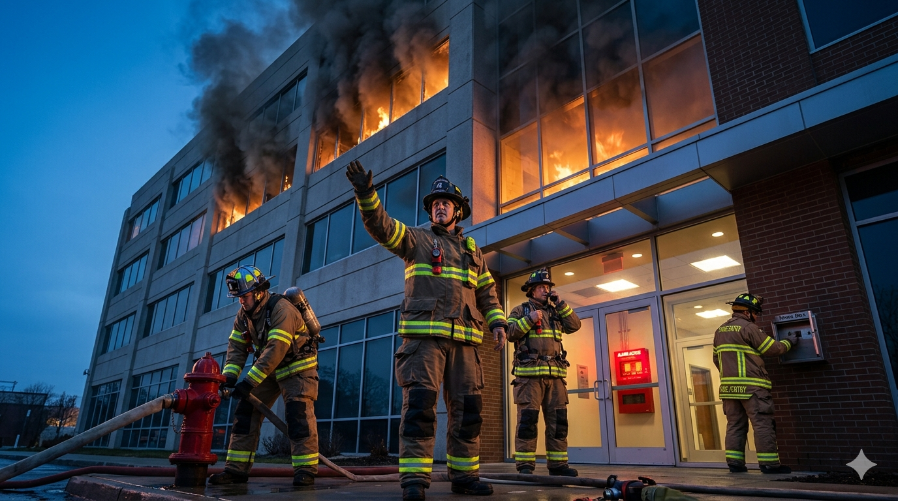

# Teams Post — Incident Response

**Channel**: Jabil Developer Network — Architecture Community
**Subject Line**: It's 3 AM. Your phone is ringing. Production is down. The next 10 minutes decide whether this costs you $10K or $10M.
**Featured Image**: `images/featured_image.png`
**Article URL**: [TO BE ADDED AFTER PUBLICATION]

---

## The First 10 Minutes Set the Trajectory

Industry average MTTR: 197 minutes. Elite teams at Google and Netflix: under 10. A big part of that gap comes down to process in the opening minutes, not just engineering talent.

## The Playbook

- **Minutes 0-1**: Acknowledge. Say "I'm looking at this." Break the silence.
- **Minutes 1-3**: Triage. What's broken? Who's affected? What changed recently?
- **Minutes 3-5**: Declare incident. Assign roles — IC (coordinates, does NOT debug), Technical Lead, Comms Lead.
- **Minutes 5-10**: First mitigation. Rollback → Feature flag → Failover → Scale → Restart. NOT root cause.

The goal of the first 10 minutes is stopping the bleeding. Root cause comes later, when you're awake and caffeinated.

## What This Means for Our Teams

The article also covers runbook design (your 3 AM brain can't think), the IC anti-pattern (IC starts debugging, nobody coordinates), communication templates for internal/external/executive updates, blameless post-incident reviews, and building incident response muscle through game days and tabletop exercises.

Includes a severity framework, runbook template, and a 4-week implementation plan.

**Part 8 of the Resilience Engineering series** — [Read the full article](ARTICLE_URL)
